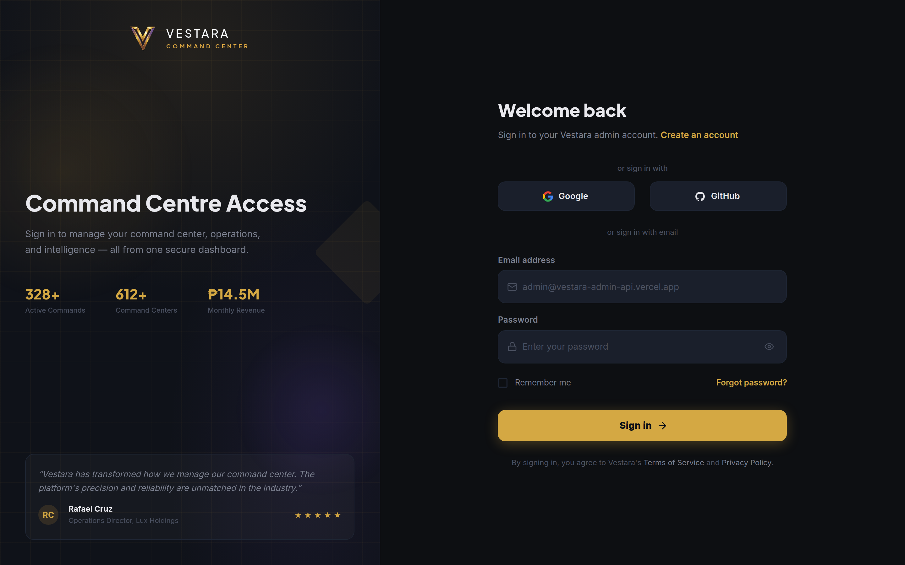
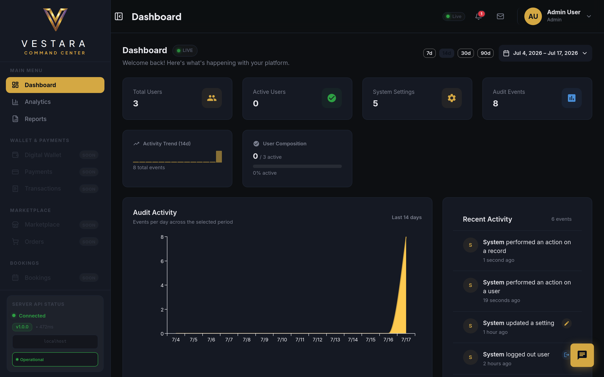
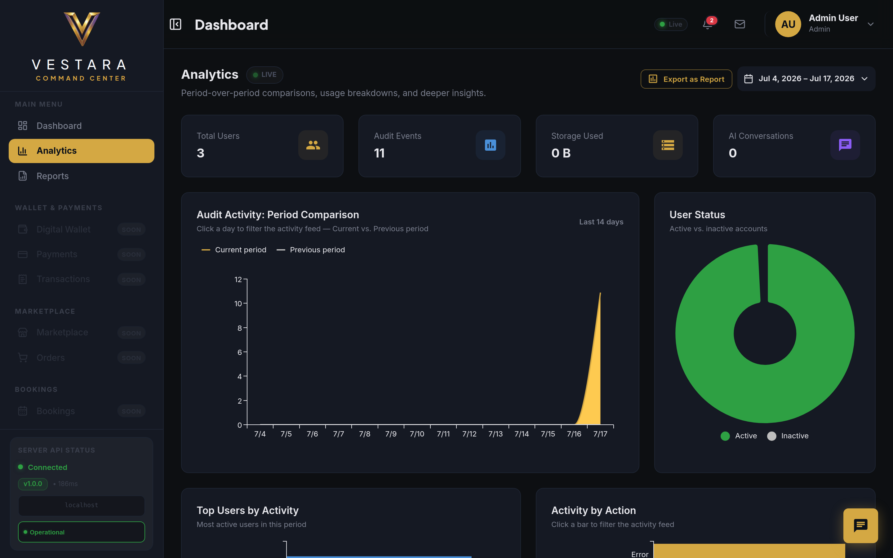
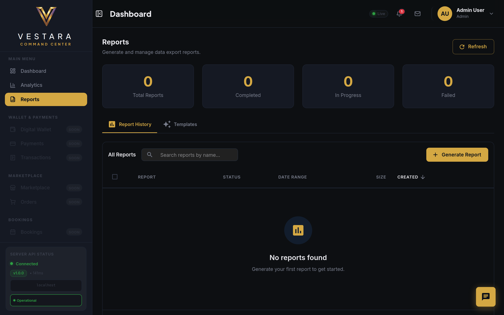
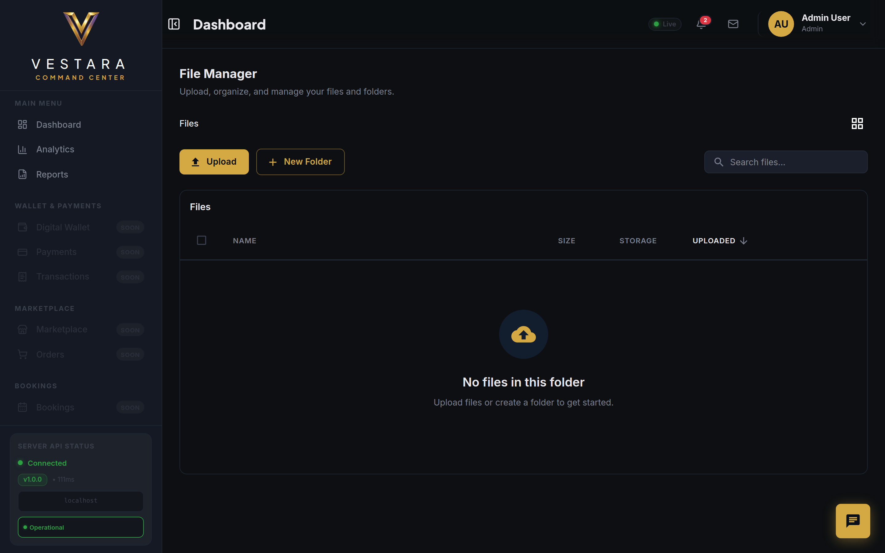
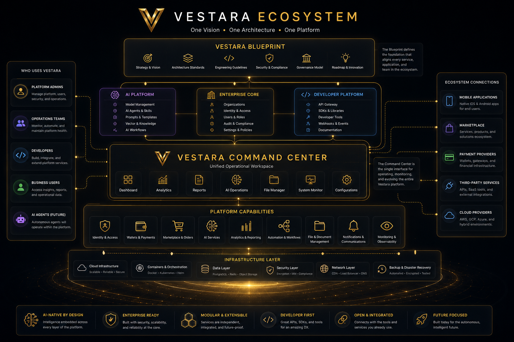
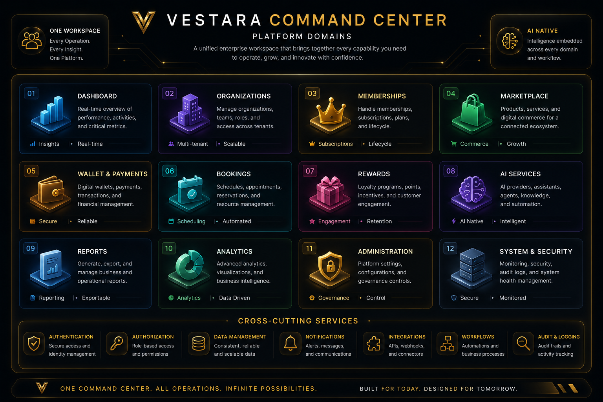

<div align="center">

# Vestara Command Center

### Enterprise Operating Platform for the Vestara AI Ecosystem

**One Platform • Every Operation • AI Native**

<br>


<br>

The official enterprise command center for managing organizations, intelligence, automation, analytics, infrastructure, and AI services across the Vestara ecosystem.

<br>


</div>

---

# Enterprise Command Center

The **Vestara Command Center** is the operational interface of the Vestara AI Platform.

Designed for modern organizations, it unifies enterprise administration, artificial intelligence, operational analytics, reporting, workflow automation, infrastructure management, and platform governance into a single AI-native workspace.

Rather than acting as a traditional administration dashboard, the Command Center serves as the operational heart of the Vestara ecosystem, providing a consistent experience for administrators, developers, operators, and future AI agents.

As the platform evolves, every Vestara service—from AI assistants and marketplace services to payment infrastructure, knowledge management, automation, and developer tooling—will integrate through this unified operational environment.

# Why This Repository Exists

The Vestara ecosystem is composed of multiple services, APIs, AI components, and future applications.

This repository delivers the enterprise command center responsible for operating those services through a single intelligent interface.

Its responsibilities include:

- Platform administration
- Organization management
- AI operations
- Marketplace administration
- Analytics
- Reporting
- System governance
- Enterprise configuration

As additional Vestara services are introduced, this repository will remain the central operational workspace for managing the platform.

# Platform at a Glance

| | |
|:---|:---|
| **Platform** | Vestara AI Platform |
| **Application** | Vestara Command Center |
| **Repository** | `vestara-admin-dashboard` |
| **Architecture** | AI-Native Enterprise Platform |
| **Frontend** | React 19 + TypeScript |
| **Backend** | Express 5 + TypeScript |
| **UI Framework** | Material UI |
| **Styling** | Tailwind CSS v4 |
| **Authentication** | JWT · OAuth · Enterprise Ready |
| **Deployment** | Cloud Native |
| **Current Status** | Active Development |

# Product Tour

The following previews demonstrate the current state of development running within the live Vestara development environment.

> Full product tour: [`docs/assets/screenshots/SCREENSHOTS.md`](./docs/assets/screenshots/SCREENSHOTS.md)

---

## 01 · Secure Authentication



Enterprise authentication designed for secure access, future single sign-on integrations, and organization-aware identity management.

---

## 02 · Operational Dashboard



A unified operational overview providing visibility into platform health, system activity, users, audit events, and operational metrics.

---

## 03 · Operational Intelligence



Interactive analytics designed for monitoring platform usage, operational trends, and enterprise insights.

---

## 04 · Enterprise Reporting



Generate, export, and manage operational reports while maintaining complete visibility across platform activities.

---

## 05 · Knowledge & Document Management



Enterprise-grade file and document management forming the foundation for future AI knowledge services and intelligent document processing.

# Designed as a Unified Enterprise Platform

<p align="center">



</p>

Unlike traditional enterprise systems composed of disconnected administrative applications, the Vestara ecosystem is designed around a unified architectural model.

Every platform service—including AI operations, enterprise administration, analytics, developer tooling, marketplace services, infrastructure, automation, and future intelligent agents—shares a common architectural foundation defined by the Vestara Blueprint.

The Command Center provides the operational interface through which these services are managed, monitored, secured, and continuously evolved.

# One Platform. Infinite Possibilities.

Modern organizations operate dozens of disconnected enterprise systems.

Identity management, infrastructure, artificial intelligence, reporting, monitoring, security, automation, collaboration, and operational analytics are frequently distributed across separate platforms with different interfaces and inconsistent operational models.

Vestara challenges that approach.

Instead of introducing another dashboard, Vestara is being built as an AI-native enterprise operating platform where every capability contributes to a unified operational experience.

The goal is simple:

> Build one intelligent platform capable of managing every aspect of modern digital operations.

# Enterprise Domains

The Vestara Command Center is composed of independent platform modules that collectively provide a unified enterprise operating experience.

| Capability | Description |
|------------|-------------|
| Enterprise Administration | Organization, user, role, and permission management |
| Identity & Security | Authentication, authorization, audit, compliance |
| Operational Intelligence | Dashboards, analytics, reporting, insights |
| AI Operations | AI providers, agents, prompts, knowledge |
| Marketplace Services | Commerce, subscriptions, digital services |
| Financial Infrastructure | Wallets, payments, transactions |
| Automation | Workflows, scheduled jobs, orchestration |
| Knowledge Management | Documents, storage, AI-ready content |
| Developer Platform | REST APIs, SDKs, integrations |
| Platform Operations | Monitoring, health checks, observability |


| Domain | Purpose |
|---------|---------|
| Dashboard | Operational overview and platform insights |
| Organizations | Multi-tenant organization management |
| Memberships | Member lifecycle and subscription management |
| Marketplace | Products, services, and digital commerce |
| Wallet & Payments | Financial transactions and digital wallets |
| Bookings | Appointment and scheduling services |
| Rewards | Loyalty and incentive programs |
| AI Services | AI assistants, providers, and automation |
| Reports | Business intelligence and reporting |
| Analytics | Platform metrics and operational intelligence |
| Administration | Configuration and governance |
| Security | Authentication, authorization, and auditing |
| System | Monitoring, health, logs, and diagnostics |

```
Users

↓

Command Center

↓

Feature Modules

↓

Shared Services

↓

Vestara API

↓

Database

↓

AI Providers
```

---

# Platform Principles

| Principle | Philosophy |
|-----------|------------|
| 🤖 AI Native | Intelligence is part of the platform, not an add-on. |
| 🏢 Enterprise Ready | Built for organizations from day one. |
| 🧩 Modular Architecture | Independent services connected through shared standards. |
| ⚡ Developer First | Modern tooling, APIs, documentation, and automation. |
| 🔒 Secure by Design | Governance, compliance, and operational security by default. |
| 🚀 Future Ready | Designed to evolve alongside autonomous AI systems. |

---

# Platform Domains



---

# Technology Stack

The Vestara Command Center is built using a modern, enterprise-ready technology stack designed for scalability, maintainability, and long-term evolution.

| Layer            | Technology                    |
| ---------------- | ----------------------------- |
| Language         | TypeScript                    |
| Frontend         | React 19                      |
| Build Tool       | Vite                          |
| UI Framework     | Material UI                   |
| Styling          | Tailwind CSS v4               |
| State Management | TanStack Query, React Context |
| Routing          | React Router v7               |
| Forms            | React Hook Form + Zod         |
| Charts           | MUI X Charts                   |
| Icons            | Material Icons                |
| HTTP Client      | Axios                         |
| Authentication   | JWT / OAuth                   |
| Backend          | Express 5                      |
| Database         | PostgreSQL                    |
| ORM              | Prisma                        |
| Package Manager  | pnpm                          |


## Frontend

| Technology | Purpose |
|------------|---------|
| React 19 | User Interface |
| TypeScript | Strongly Typed Development |
| Vite | Build Tool |
| Material UI | Enterprise Component Library |
| Tailwind CSS v4 | Utility-First Styling |
| React Router | Client Routing |
| TanStack Query | Server State Management |
| MUI X Charts | Data Visualization |

---

## Backend

| Technology | Purpose |
|------------|---------|
| Express 5 | High Performance REST API |
| TypeScript | Backend Development |
| Prisma ORM | Database Access |
| PostgreSQL | Primary Database |
| Redis | Cache & Sessions |
| JWT | Authentication |
| Zod | Validation |

---

## Infrastructure

| Technology | Purpose |
|------------|---------|
| Docker | Containerization |
| Docker Compose | Local Development |
| GitHub Actions | CI/CD |
| Nginx | Reverse Proxy |
| Cloudflare | DNS & CDN |
| AWS | Cloud Infrastructure |

---

## AI & Automation

The platform has been designed to support multiple AI providers and autonomous workflows.

Current and planned integrations include:

- OpenAI
- Anthropic Claude
- Google Gemini
- Ollama
- Local LLMs
- Retrieval-Augmented Generation (RAG)
- AI Agents
- Workflow Automation

---

# Project Architecture

The Vestara Command Center follows a domain-driven architecture organized as a pnpm monorepo with Turborepo orchestration.

```text
vestara-admin-dashboard
│
├── apps/
│   ├── api/                 # Express 5 backend (@vestara/api)
│   │   ├── prisma/          # Schema, migrations, seed
│   │   └── src/             # Routes, services, repositories
│   │
│   └── web/                 # React 19 SPA (@vestara/web)
│       └── src/             # Components, features, pages
│
├── packages/                # Shared monorepo packages
│   ├── types/               # @vestara/types
│   ├── constants/           # @vestara/constants
│   ├── validation/          # @vestara/validation
│   ├── utils/               # @vestara/utils
│   └── config/              # @vestara/config
│
├── docs/                    # Documentation portal
│   ├── assets/              # Visual assets (VDS-101 through VDS-106)
│   ├── decisions/           # Architecture Decision Records
│   └── standards/           # Engineering standards
│
├── screens/                 # Product screenshots
├── turbo.json               # Turborepo pipeline config
├── pnpm-workspace.yaml      # Workspace definition
└── package.json
```
│   ├── store/
│   ├── theme/
│   ├── types/
│   └── utils/
│
└── public/
```

Each feature domain encapsulates its own components, pages, services, hooks, and business logic, allowing the platform to scale while maintaining clear architectural boundaries.

Each feature is designed to evolve independently while remaining consistent with the Vestara Blueprint and shared engineering standards.

---

# Repository Structure

The repository is organized into logical areas that separate source code, documentation, assets, automation, and project configuration.

```text
vestara-admin-dashboard
│
├── .github/             GitHub workflows and templates
├── apps/                Application source code
│   ├── api/             Express 5 backend
│   └── web/             React 19 frontend
├── docs/                Documentation portal (VDS)
│   ├── assets/          Visual assets (diagrams, screenshots)
│   ├── decisions/       Architecture Decision Records
│   └── standards/       Engineering standards
├── packages/            Shared monorepo packages
├── screens/             Product screenshots
│
├── package.json
├── pnpm-lock.yaml
├── turbo.json
├── pnpm-workspace.yaml
├── README.md
└── LICENSE
```

---

# Documentation

The Vestara Documentation Portal follows the [Vestara Documentation Standard (VDS)](./docs/standards/VDS.md) and provides comprehensive guides for developers, architects, and contributors.

| Document | Purpose |
|----------|---------|
| [Overview](./docs/OVERVIEW.md) | Platform overview and principles |
| [Quick Start](./docs/QUICK_START.md) | Get running in 5 minutes |
| [Architecture](./docs/assets/architecture/ARCHITECTURE.md) | System design and data flow |
| [Frontend Guide](./docs/FRONTEND.md) | React, MUI, theming, components |
| [Backend Guide](./docs/BACKEND.md) | Express, Prisma, services, routes |
| [AI Platform](./docs/AI_PLATFORM.md) | Providers, chat, RAG, data connectors |
| [Security](./docs/SECURITY.md) | Auth, hardening, policies |
| [API Reference](./docs/api/README.md) | Full REST API documentation |
| [Deployment](./docs/DEPLOYMENT.md) | Vercel and self-hosted guides |
| [Changelog](./docs/CHANGELOG.md) | Version history |
| [Roadmap](./docs/ROADMAP.md) | Development phases and status |

### Visual Assets (VDS)

| ID | Asset | Location |
|----|-------|----------|
| VDS-101 | Hero Banner | [`screens/vds/`](./screens/vds/) |
| VDS-102 | Architecture Diagram | [`docs/assets/architecture/`](./docs/assets/architecture/) |
| VDS-103 | Platform Domains | [`screens/vds/`](./screens/vds/) |
| VDS-104 | Product Tour | [`docs/assets/screenshots/`](./docs/assets/screenshots/) |
| VDS-105 | Technology Stack | [`docs/assets/technology/`](./docs/assets/technology/) |
| VDS-106 | Repository Structure | [`docs/assets/diagrams/`](./docs/assets/diagrams/) |

---

# Installation

Clone the repository.

```bash
git clone https://github.com/evillan0315/vestara-admin-dashboard.git
```

Enter the project.

```bash
cd vestara-admin-dashboard
```

Install dependencies.

```bash
pnpm install
```

---

# Development Environment

The project uses modern development tooling.

Requirements

- Node.js 22+
- pnpm
- Git
- Docker (optional)
- PostgreSQL
- Redis

---

# Running the Project

Start the development server.

```bash
pnpm dev
```

Build the project.

```bash
pnpm build
```

Preview production.

```bash
pnpm preview
```

Lint the project.

```bash
pnpm lint
```

Run tests.

```bash
pnpm test
```

---

# API Integration

The dashboard communicates with the Vestara API through REST endpoints.

Major service domains include:

- Authentication
- Organizations
- Users
- Analytics
- Reports
- Files
- Marketplace
- Wallet
- AI Services
- Notifications
- Audit Logs
- Platform Settings

Future releases will introduce GraphQL, WebSocket support, and AI-native event streaming.

---

# Configuration

Application configuration is centralized and environment-driven.

Configuration areas include:

- Authentication
- Branding
- Feature Flags
- Storage Providers
- AI Providers
- Logging
- Monitoring
- API Endpoints

The goal is to minimize hard-coded values and enable flexible deployments across development, staging, and production environments.

---

# Environment Variables

Example configuration.

```env
VITE_API_URL=http://localhost:5000

VITE_APP_NAME=Vestara

VITE_ENABLE_AI=true

VITE_ENABLE_ANALYTICS=true

VITE_ENABLE_MARKETPLACE=true

VITE_GOOGLE_CLIENT_ID=

VITE_GITHUB_CLIENT_ID=
```

---

# Development Roadmap

The Command Center is being developed incrementally following the Vestara Blueprint.

| Phase | Status |
|---------|:------:|
| Authentication | ✅ |
| Dashboard | ✅ |
| Analytics | ✅ |
| Reports | ✅ |
| File Management | ✅ |
| Organizations | 🚧 |
| Marketplace | 🚧 |
| Wallet | 🚧 |
| Payments | 🚧 |
| AI Services | 🚧 |
| Knowledge Platform | 🚧 |
| Mobile Integration | 📅 |
| AI Agents | 📅 |
| Workflow Automation | 📅 |
| Multi-Tenancy | 📅 |
| Enterprise Monitoring | 📅 |

Long-term development is guided by the Vestara Blueprint and focuses on transforming the Command Center into a comprehensive enterprise operating platform.

---

# Contributing

Contributions are welcome.

Before submitting changes, please:

- Read the Vestara Blueprint.
- Follow the Vestara Documentation Standard (VDS).
- Follow the Vestara Engineering Standards.
- Use Conventional Commits.
- Maintain TypeScript strict mode.
- Keep components modular and reusable.
- Write clear documentation for new functionality.

Every contribution should improve the consistency, maintainability, and long-term vision of the platform.

---

# Engineering Philosophy

Vestara is engineered around a simple principle:

> Complexity should exist inside the platform, not in the user experience.

Every architectural decision is evaluated against four questions:

- Does it reduce operational complexity?
- Can it scale across organizations?
- Can AI enhance this workflow?
- Will it remain maintainable five years from now?

This philosophy guides every design decision throughout the Vestara ecosystem.

---

# License

This project is licensed under the MIT License.

See the `LICENSE` file for additional information.

# Vestara Ecosystem

| Repository | Purpose |
|------------|---------|
| Vestara Blueprint | Strategic architecture and engineering standards |
| Vestara Command Center | Enterprise administration platform |
| Vestara API | Backend services |
| Vestara AI Platform | AI infrastructure |
| Vestara Mobile | Mobile experience |
| Vestara SDK | Developer toolkit |
| Vestara CLI | Command-line tooling |

---

<div align="center">

## Building the Future of AI-Native Enterprise Platforms

The Vestara Command Center is more than an administration dashboard.

It is the operational interface of a growing ecosystem designed to unify enterprise operations, artificial intelligence, automation, and digital services into one intelligent platform.

**One Vision • One Architecture • One Platform**

---

**Part of the Vestara Ecosystem**

Vestara Blueprint • Command Center • API • AI Platform • Mobile • Marketplace • SDK • CLI

</div>

---

> 📚 This repository follows the **Vestara Documentation Standard (VDS)** to ensure consistency across the entire Vestara ecosystem.
