<h1 align="center">
  <br />
  VESTARA
</h1>

<p align="center">
  <strong>The Unified Digital Investment, Wallet, Rewards, Marketplace, and Financial Ecosystem</strong>
</p>

<p align="center">
  Build. Trade. Earn. Grow.
</p>

---

<p align="center">


</p>

<p align="center">

**A modern enterprise platform that unifies digital wallets, rewards, commerce, investments, bookings, and future financial services into a single scalable ecosystem.**

</p>

---

# 🌍 Overview

**Vestara** is a next-generation digital financial ecosystem designed to provide individuals, businesses, and future investors with a secure, scalable, and intelligent platform for managing digital value.

Rather than operating as separate applications, Vestara brings together financial services, commerce, digital payments, loyalty rewards, bookings, and future investment capabilities under one unified experience.

The platform has been architected using a modular, domain-driven monorepo architecture, enabling rapid feature development while maintaining enterprise-grade reliability, security, and scalability.

Whether users are purchasing products, transferring funds, earning rewards, booking premium services, or eventually investing in digital assets, every interaction is powered by a common infrastructure centered around security, performance, and exceptional user experience.

---

# 📸 Application Screenshots

## Admin Dashboard

| Dashboard Overview | Full HD Dashboard |
|--------------------|-------------------|
|  |  |

The admin dashboard is fully data-driven and real-time:

- **Dashboard (`/`)** — KPI cards (Total Users, Active Users, System Settings, Audit Events with trend vs. previous period), Audit Activity area chart, User Status donut, Activity-by-Action / Activity-by-Entity bar charts, and a Recent Activity feed. The organization **name** is shown (not the raw id), and all data refreshes live via WebSocket events.
- **Analytics (`/analytics`)** — a dedicated live analytics page backed by real API data with a 7/14/30/90-day range selector, KPI trend deltas, the same chart suite, and a Recent Activity feed. Refreshes in real time through `useLiveDashboard()`.
- Shared chart/activity aggregation logic lives in the `apps/web/src/features/analytics` module, reused by both pages.

---

## Elite Companion Dashboard

| Dashboard Overview | Elite Companion |
|--------------------|-----------------|
| 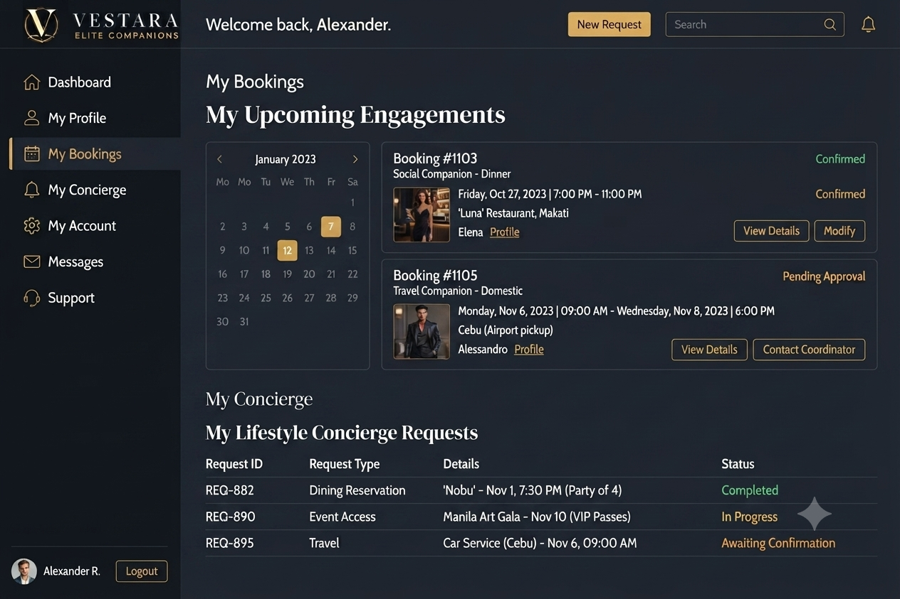 |  |

---

## Landing Pages

| Main Landing | Companion Page |
|--------------|----------------|
|  |  |

| Individual Companion | Elite Companions |
|----------------------|------------------|
|  |  |

---

## Elite Companions Platform

| Elite Companion | Premium Companion |
|-----------------|-------------------|
|  |  |

| Companion Services | Luxury Companion |
|--------------------|------------------|
|  |  |

---

## Elite Screenshots (Detailed)

| Dashboard Overview | Client Management |
|--------------------|-------------------|
|  | 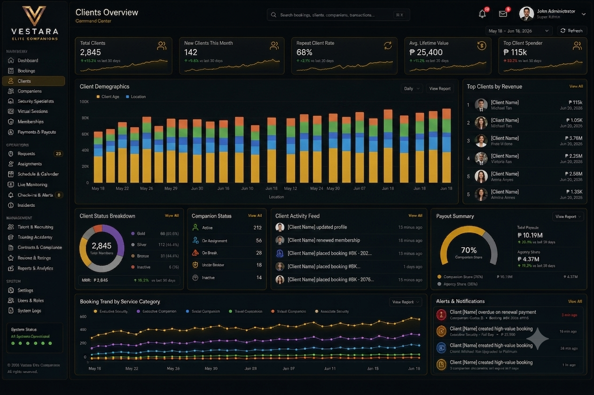 |

| Companion Management | Membership |
|----------------------|------------|
|  | 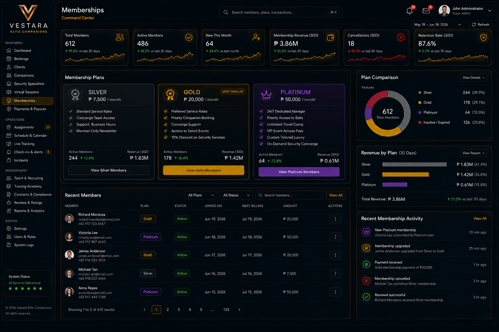 |

| Bookings | Payments & Payouts |
|----------|--------------------|
|  | 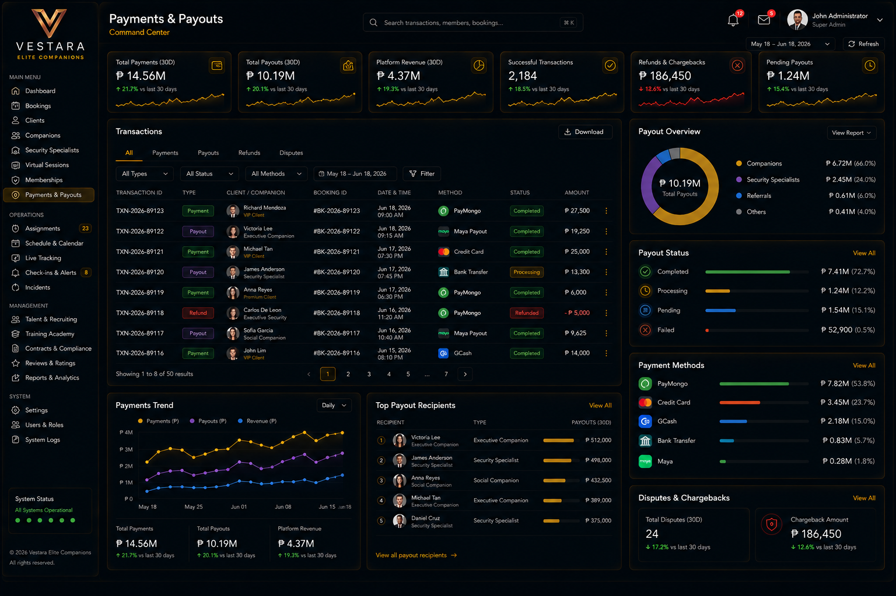 |

| User Profile | User Settings |
|--------------|---------------|
| 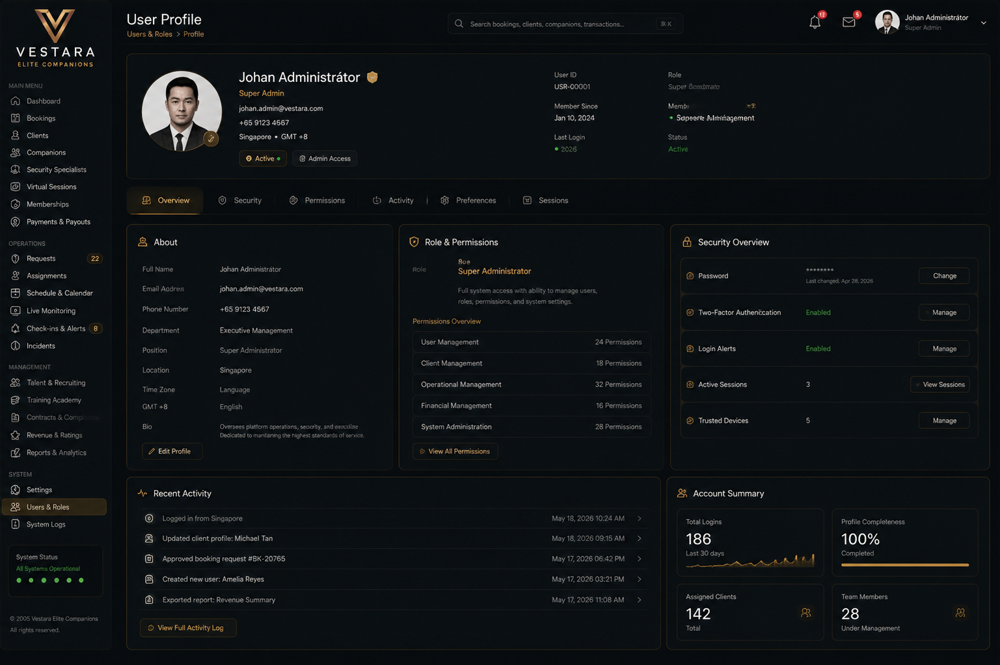 | 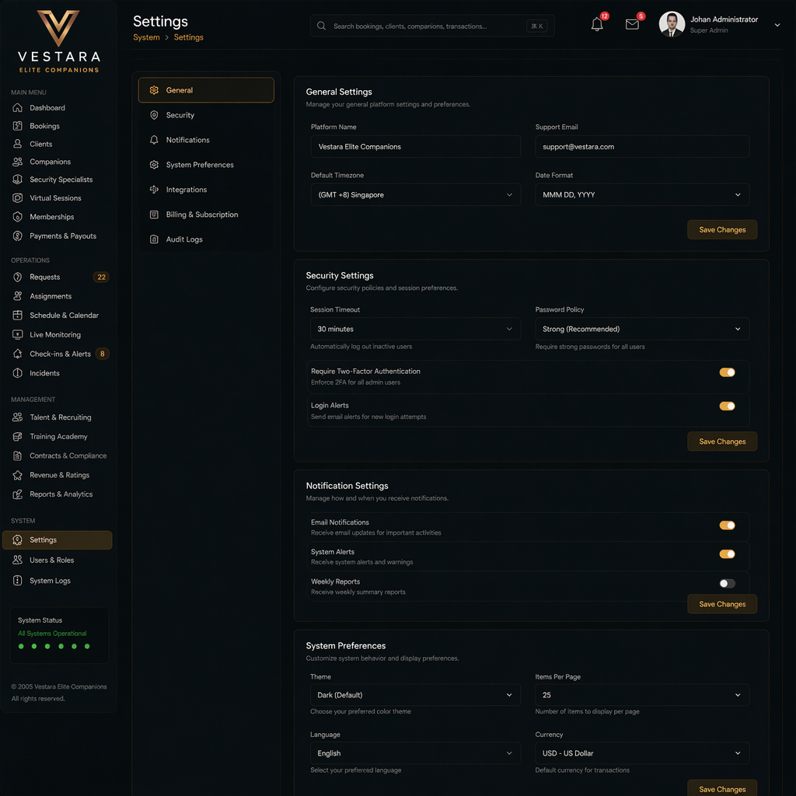 |

---

## Marketing & Promotional

| FB Post | Promotional Content |
|---------|---------------------|
|  |  |

| Marketing | Investor Marketing |
|-----------|-------------------|
|  |  |

---

## Elite Companion Profiles

| Luxury Evening Gown | Executive Business |
|---------------------|-------------------|
|  |  |

| Filipino Elite | Resort Companion |
|----------------|------------------|
|  |  |

---

# ✨ Platform Highlights

- 💳 Unified Digital Wallet
- 🛍 Marketplace Commerce
- 🎁 Rewards & Loyalty Platform
- 📈 Investment Marketplace
- 🏦 Peer-to-Peer Lending
- 🪙 Vestara Points (VP)
- ✈️ Premium Travel & Booking
- 🤖 AI Financial Assistant
- 🔐 Enterprise Security
- ☁️ Cloud-Native Architecture
- 📊 Real-Time Analytics
- 🔌 API-First Platform

---

## ✨ Vision

> **Create a borderless digital economy where people and businesses can build, exchange, invest, and grow wealth through one unified platform.**

Vestara aims to remove the fragmentation between digital finance, commerce, and investment by delivering a seamless ecosystem capable of evolving alongside emerging financial technologies.

---

## 🎯 Mission

Our mission is to build secure, accessible, and intelligent financial tools that empower anyone to participate in the global digital economy.

Vestara focuses on:

- Making digital finance accessible
- Simplifying online commerce
- Rewarding customer engagement
- Enabling secure value exchange
- Preparing users for future investment opportunities
- Supporting enterprise-grade scalability

---

## 🚀 Platform Highlights

Vestara combines multiple products into one ecosystem.

| Platform | Description |
|-----------|-------------|
| 💳 **Digital Wallet** | Secure wallets supporting balances, transfers, deposits, withdrawals, and statements |
| 🛍️ **Marketplace** | Buy and sell products, services, and future digital assets |
| ⭐ **Vestara Points (VP)** | Loyalty and rewards engine integrated across the platform |
| 💰 **Payments** | Internal transfers with future support for banking and e-wallet providers |
| 📊 **Administration** | Enterprise dashboards, monitoring, reporting, moderation, and analytics |
| 📅 **Bookings** | Reservation platform for premium experiences, hospitality, and future service marketplaces |
| 👥 **User Profiles** | Identity management, personalization, and KYC preparation |
| 📈 **Investments (Roadmap)** | Stocks, crypto, crowdfunding, and tokenized assets |
| 🤖 **AI Chatbot** | In-app AI assistant powered by OpenCode (free models) with multi-provider fallback |
| 🤖 **AI Assistant RAG** | Data-aware AI with real-time org context injection — answers questions about users, activity, settings, storage, and KPIs |
| 🤖 **Floating Chat Widget** | AI assistant accessible from every screen via FAB, keyboard shortcut (`Cmd+Shift+K`), page-aware suggestions, minimized bar, and full-page navigation |
| 🔌 **AI Data Connector** | Configure external REST APIs, auto-fetch + analyze JSON, and render AI-assisted charts — secrets stored server-side, charts render via heuristic even without an AI key |

---

## 🧭 Sidebar Navigation

The admin dashboard sidebar is organized into domain groups that mirror the platform highlights above. Implemented modules are fully navigable; documented roadmap modules are shown with a **Soon** badge and do not navigate until built.

| Group | Items |
|-------|-------|
| **MAIN MENU** | Dashboard (`/`), Analytics (`/analytics`), Reports (`/reports`) |
| **WALLET & PAYMENTS** | Digital Wallet *(Soon)*, Payments *(Soon)*, Transactions *(Soon)* |
| **MARKETPLACE** | Marketplace *(Soon)*, Orders *(Soon)* |
| **BOOKINGS** | Bookings *(Soon)* |
| **REWARDS** | Vestara Points *(Soon)* |
| **AI SERVICES** | AI Chat (`/chat`), Integrations (`/integrations`), Data Explorer (`/integrations`) |
| **MANAGEMENT** | Users & Roles (`/users`), Organizations (`/organizations`) |
| **SYSTEM** | Settings (`/settings`), File Manager (`/files`), System Logs (`/system-logs`), Admin (`/admin`), Documentation (`/docs`) |
| **SECURITY** | Security Center *(Soon)* |

Navigation items respect role-based access control (`requireRole`): administrative and organization-scoped entries are restricted to `SUPER_ADMIN` / `ADMIN` (and `MODERATOR` for integrations), while roadmap items are visible to all authenticated users but disabled.

---

## 🖥️ Platform Experience

Vestara delivers a consistent premium experience across every module.

### Executive Administration

- Enterprise analytics
- User management
- Fraud monitoring
- Audit logs
- Marketplace moderation
- Financial reporting
- Risk management

---

### Digital Wallet

- Multi-wallet accounts
- Internal transfers
- QR payments
- Deposit requests
- Withdrawal requests
- Transaction history
- Financial statements
- Spending analytics

---

### Marketplace

- Premium product listings
- Digital products
- Physical goods
- Seller management
- Inventory
- Checkout
- Secure escrow
- Ratings and reviews

---

### Bookings

- Hotel reservations
- Flight bookings
- Transportation
- Premium experiences
- Companion services
- Calendar management
- Booking analytics
- Reservation management

---

### Rewards

Vestara Points provide a unified rewards system across the ecosystem.

Users earn points through:

- Purchases
- Marketplace activity
- Promotions
- Referrals
- Campaigns
- Future staking programs

Points can later be redeemed for:

- Marketplace purchases
- Exclusive offers
- Premium memberships
- Digital services
- Future investment incentives

---

# 🏗️ Why Vestara?

Unlike traditional applications that solve only one problem, Vestara is designed as a **Financial Super Platform**.

Instead of managing separate applications for:

- Wallets
- Payments
- Rewards
- Commerce
- Investments
- Bookings
- Digital Assets

everything operates within a unified architecture with a consistent user experience.

This enables:

- Faster innovation
- Lower operational complexity
- Unified authentication
- Shared identity
- Centralized analytics
- Consistent security
- Better customer experience

---

# 🌟 Core Principles

Vestara is built upon six engineering principles.

### Security First

Every module is designed around modern security best practices including authentication, authorization, auditing, encryption, and least-privilege access.

---

### Modular Architecture

Every domain exists independently while remaining tightly integrated through shared packages and APIs.

---

### Developer Experience

Modern tooling enables rapid development with:

- TypeScript
- Strict typing
- Shared packages
- Automated testing
- CI/CD
- API documentation
- Hot reload
- Monorepo workflows

---

### Enterprise Scalability

Vestara is engineered for growth from MVP to enterprise deployment through horizontal scaling, background processing, distributed caching, and cloud-native infrastructure.

---

### Beautiful User Experience

Every interface follows a premium design language featuring:

- Glassmorphism
- Dark luxury themes
- Metallic gold accents
- Modern enterprise layouts
- Responsive design
- Accessibility
- Performance-first rendering

---

### Future Ready

The architecture intentionally supports future expansion into:

- Cryptocurrency
- Lending
- Venture Capital
- Crowdfunding
- Tokenized Assets
- AI Automation
- Wealth Management
- International Payments

---

## 📖 Table of Contents

- Overview
- Vision
- Mission
- Platform Highlights
- Platform Modules
- Architecture
- Technology Stack
- Repository Structure
- Development Setup
- Environment Variables
- Security
- Database Design
- API Architecture
- CI/CD Pipeline
- Deployment
- Roadmap
- Contributing
- License
- Disclaimer


## 🧩 Platform Modules & Features

Vestara is built using a modular, domain-driven architecture where each business capability is encapsulated into its own bounded context while seamlessly integrating with the rest of the ecosystem.

Every module shares a common authentication system, permission model, API standards, design language, and infrastructure, ensuring consistency, scalability, and maintainability.

---

## 🔐 Authentication & Identity

Authentication is the foundation of the Vestara ecosystem, providing secure identity management across every application and service.

## Core Features

- User Registration
- Secure Login
- JWT Authentication
- Refresh Token Rotation
- Email Verification
- Password Recovery
- Session Management
- Device Tracking
- Role-Based Access Control (RBAC)
- Permission-Based Authorization
- OAuth Ready
- API Authentication
- Audit Logging

### Future Enhancements

- Multi-Factor Authentication (MFA)
- Passkeys (WebAuthn)
- Biometric Authentication
- Social Login Providers
- Enterprise SSO (OIDC / SAML)

---

## 👤 User Profiles

User profiles provide personalization, identity management, and compliance preparation.

## Features

- Personal Information
- Avatar Uploads
- Contact Details
- Address Management
- Notification Preferences
- Language Preferences
- Theme Preferences
- Privacy Settings
- KYC Preparation
- Document Uploads
- Account Verification Status

---

## 💳 Vestara Wallet

The Vestara Wallet powers every financial transaction throughout the ecosystem.

Designed as a secure multi-account wallet infrastructure, it enables users to safely manage balances, transfer funds, and monitor financial activity.

## Features

### Wallet Accounts

- Primary Wallet
- Savings Wallet
- Business Wallet
- Rewards Wallet
- Multi-Currency Ready

### Financial Operations

- Internal Transfers
- Deposit Requests
- Withdrawal Requests
- QR Payments
- Peer-to-Peer Transfers
- Scheduled Transfers
- Transaction History
- Downloadable Statements

### Analytics

- Cash Flow
- Spending Analysis
- Monthly Reports
- Income vs Expenses
- Financial Insights

---

## ⭐ Vestara Points (VP)

Vestara Points (VP) is the platform's unified rewards and loyalty system.

Rather than existing as an isolated rewards program, VP is integrated across every product inside the Vestara ecosystem.

## Earn Points

Users can earn points through:

- Marketplace Purchases
- Daily Engagement
- Referrals
- Promotional Campaigns
- Loyalty Programs
- Future Staking Programs

## Redeem Points

Points may be redeemed for:

- Marketplace Purchases
- Digital Products
- Membership Benefits
- Service Discounts
- Promotional Rewards
- Future Investment Incentives

---

## 🛍 Marketplace

The Vestara Marketplace provides a secure commerce platform supporting both physical and digital products.

It is designed to scale into a complete digital commerce ecosystem.

## Buyer Features

- Product Discovery
- Categories
- Advanced Search
- Product Reviews
- Wishlists
- Shopping Cart
- Secure Checkout
- Order Tracking
- Purchase History

## Seller Features

- Seller Dashboard
- Product Listings
- Inventory Management
- Order Management
- Sales Analytics
- Revenue Reports
- Customer Reviews

## Commerce Features

- Product Variants
- Digital Products
- Physical Products
- Coupons
- Promotions
- Featured Products
- Secure Escrow
- Marketplace Moderation

---

# 📅 Booking Platform

Vestara Bookings extends the ecosystem beyond commerce by supporting reservations for travel, hospitality, experiences, premium services, and future concierge offerings.

The booking system follows the same luxury enterprise design language as the Wallet and Marketplace.

## Booking Categories

- Hotels
- Resorts
- Flights
- Transportation
- Experiences
- Events
- Premium Services
- Elite Companion Services

## Features

- Reservation Dashboard
- Booking Calendar
- Property Management
- Booking Analytics
- Availability Tracking
- Payment Integration
- Reservation Timeline
- Customer Profiles
- Reviews
- Notifications

---

# 💰 Payments

The payment infrastructure powers every financial interaction inside Vestara.

## Current Features

- Deposit Requests
- Withdrawal Requests
- Wallet Transfers
- Marketplace Payments
- Booking Payments
- Internal Settlement
- Transaction History

## Planned Integrations

- GCash
- Maya
- Coins.ph
- Bank Transfers
- Visa
- Mastercard
- PayPal
- Stripe
- Cryptocurrency Networks

---

# 📈 Investments (Roadmap)

Vestara has been architected to support investment services without requiring significant infrastructure changes.

## Planned Modules

- Stock Trading
- ETF Investing
- Mutual Funds
- Cryptocurrency
- Portfolio Management
- Dividend Tracking
- Investment Analytics
- Automated Investing

---

# 🏦 Lending (Roadmap)

Future lending services will enable users and institutions to participate in decentralized and traditional lending models.

## Planned Features

- Personal Loans
- Business Loans
- Investor Pools
- Borrower Profiles
- Loan Marketplace
- Interest Distribution
- Risk Scoring
- Credit Evaluation

---

# 🪙 Digital Assets (Roadmap)

Vestara is designed to evolve into a comprehensive digital asset platform.

## Planned Features

- Cryptocurrency Wallets
- NFT Marketplace
- Stablecoins
- Tokenized Assets
- Digital Collectibles
- Asset Exchange
- Cross-Chain Support

---

# 🛡 Administration Portal

The Administration Portal provides enterprise-grade operational visibility across the entire ecosystem.

Designed for administrators, compliance teams, and operations personnel, it centralizes platform management, analytics, and security monitoring.

## User Management

- User Directory
- Roles
- Permissions
- Account Verification
- Suspensions
- Identity Verification

## Multi-Tenant Organizations

- Organization Directory
- Organization Creation (Super Admin)
- Organization Settings
- Organization Members Management
- Cross-Organization User Management (Super Admin)
- Organization-Scoped Resources & Settings

## Marketplace Administration

- Product Moderation
- Seller Verification
- Inventory Monitoring
- Dispute Resolution

## Financial Monitoring

- Transaction Oversight
- Wallet Monitoring
- Payment Reviews
- Withdrawal Approvals

## Security

- Fraud Detection
- Risk Monitoring
- Device Intelligence
- Audit Logs
- Security Events

## Reporting

- Financial Reports
- Marketplace Analytics
- Revenue Dashboards
- Customer Insights
- Platform Statistics

---

# 🤖 AI Services

Vestara integrates AI-powered features to enhance the user experience throughout the platform.

## AI Chatbot (Implemented)

The admin dashboard includes a fully integrated AI chatbot accessible at `/chat`. The chatbot features:

- **Multi-provider architecture** — pluggable AI provider abstraction with automatic fallback
- **OpenCode integration** — powered by free-tier models (`mimo-v2.5-free`, `deepseek-v4-flash-free`, `nemotron-3-ultra-free`, `north-mini-code-free`)
- **Conversation management** — persistent chat history with org-scoped conversations
- **Responsive UI** — mobile-optimized chat interface with suggestion chips and typing indicators
- **OpenAI-compatible API** — supports any provider exposing the `/chat/completions` endpoint
- **Reasoning model support** — extracts answers from `reasoning`, `reasoning_content`, and `reasoning_details` fields
- **RAG: Data-Aware AI (Priority 1 Complete)** — real-time organization context injection before each completion:
  - Organization info (name, slug, member count)
  - User summary (total, active, inactive, by role)
  - Dashboard KPIs (users, activity, errors, storage)
  - Recent audit logs (last 10 actions with timestamps and actors)
  - System settings (non-sensitive, first 15)
  - File storage stats (total files, size, by provider, recent uploads)
  - Current user's recent activity (last 5 actions)
  - 60-second per-conversation cache with token budget management

### Provider Priority

```
OpenCode → OpenAI → Anthropic → Mock (fallback)
```

### Environment Variables

| Variable | Purpose |
|----------|---------|
| `OPENCODE_API_KEY` | OpenCode API key (required for OpenCode provider) |
| `OPENCODE_BASE_URL` | OpenCode API base URL (default: `https://opencode.ai/zen/v1`) |
| `OPENAI_API_KEY` | OpenAI API key (optional) |
| `OPENAI_BASE_URL` | OpenAI-compatible base URL (optional) |
| `ANTHROPIC_API_KEY` | Anthropic API key (optional) |

## Floating Chat Widget (Implemented)

The AI Assistant is also accessible from every page through a floating chat widget:

- **Floating Action Button (FAB)** — glow-shadowed chat icon fixed at the bottom-right corner of every screen
- **Keyboard Shortcut** — press `Cmd+Shift+K` (Mac) / `Ctrl+Shift+K` (Windows/Linux) to toggle the widget from any page
- **3-State View Modes** — FAB (closed), minimized bar showing the last assistant message preview, or full chat panel
- **Page-Aware Suggestions** — shows context-relevant question chips based on the current route (e.g., user management, settings, files, analytics)
- **Open in Full Page** — one-click navigation to the dedicated `/chat` page
- **Chat Panel** — 400px wide / 620px max-height on desktop, full-screen on mobile, with `Fade` animation
- **Auto-resumes** the most recent active conversation when opened
- **Full chat functionality** — send messages, markdown rendering, suggestion chips, typing indicator, copy button
- **Seamless integration** — rendered inside `DashboardLayout` so it appears across all routes without page refresh
- **Reuses existing backend** — shares the same API, hooks, and conversation history as the full `/chat` page

## Integrations — AI Data Connector (Implemented)

Connect external REST APIs and visualize their JSON automatically. Admins configure a data source (URL, HTTP method, headers, query params, and auth) through a UI; the backend fetches the endpoint, normalizes the JSON, infers field types and chart suggestions, and the frontend renders auto-generated charts with AI-assisted enhancement.

- **User-configurable sources** — create, edit, and delete data sources from the `Integrations` page (`/integrations`), org-scoped to the current organization
- **Flexible auth** — `none`, `bearer` token, or `basic` credentials; secrets are stored server-side and **never** returned to the client (masked with `••••` in the UI)
- **Auto visualization** — the `/data-explorer` page (`/data-explorer`) fetches the live response, runs the analyzer, and renders charts (bar, line, pie, etc.) using `@mui/x-charts`
- **Heuristic + AI analysis** — a heuristic analyzer infers field types, dimensions, and measures to build a visualization spec; when `OPENCODE_API_KEY` is set, an AI pass improves the chart type, titles, and axis suggestions
- **AI is an enhancement, not a dependency** — charts render from the heuristic spec even when no AI key is configured
- **Audit logging** — all create/update/delete/fetch actions are recorded (`DATA_SOURCE_CREATE`, `DATA_SOURCE_UPDATE`, `DATA_SOURCE_DELETE`, `DATA_SOURCE_FETCH`)
- **Access control** — write endpoints require `SUPER_ADMIN`/`ADMIN`/`MODERATOR`; read/fetch is open to any authenticated user

### Endpoints

Routes are mounted under `/api/v1/integrations`:

| Method | Path | Auth | Description |
|--------|------|------|-------------|
| `GET` | `/integrations` | user | List data sources for the current org |
| `POST` | `/integrations` | admin+ | Create a data source |
| `GET` | `/integrations/:id` | user | Get a data source by id |
| `PUT` | `/integrations/:id` | admin+ | Update a data source |
| `DELETE` | `/integrations/:id` | admin+ | Delete a data source |
| `POST` | `/integrations/:id/fetch` | user | Fetch the external API and return analyzed data |

### Environment Variables

| Variable | Purpose |
|----------|---------|
| `OPENCODE_API_KEY` | Optional — enables AI-assisted chart enhancement for the connector |

## Planned AI Features

- Financial Recommendations
- Fraud Detection
- Spending Insights
- Personalized Marketplace
- Smart Search
- Intelligent Notifications
- Predictive Analytics
- Tool Calling / Function Calling (Priority 2)
- Streaming Responses (Priority 3)
- Smart Suggestions & Contextual Awareness (Priority 4)
- Feedback & Quality Loop (Priority 5)

---

# 🏛 Shared Platform Services

Every module relies on a common set of shared platform capabilities.

- Authentication
- Authorization
- Notifications
- File Storage
- Email Services
- Audit Logging
- Background Jobs
- Event Bus
- Shared Validation
- Shared UI Components
- Shared SDK
- Shared API Clients

---

## 🏗️ System Architecture

Vestara follows a modern cloud-native architecture built around a scalable monorepo.

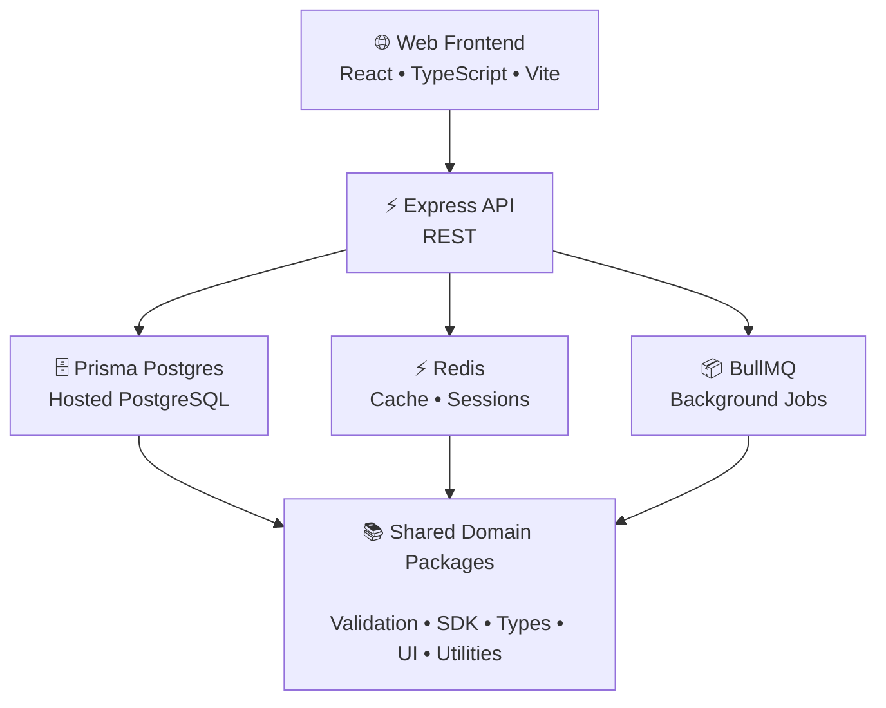
---

# 🏛 Monorepo Architecture

```text
vestara/
│
├── apps/
│   ├── web/              # React 19 Frontend (Vite)
│   └── api/              # Express 5 Backend
│
├── packages/
│   ├── types/            # Shared TypeScript types & enums
│   ├── constants/        # Global constants
│   ├── validation/       # Zod validation schemas
│   ├── utils/            # Shared utilities
│   └── config/           # Shared configuration
│
├── prisma.config.ts       # Prisma config (schema: apps/api/prisma/schema.prisma)
├── apps/api/prisma/
│   ├── schema.prisma
│   ├── migrations/
│   └── seed.ts
│
├── docs/
│   ├── architecture/
│   ├── api/
│   ├── screenshots/
│   └── decisions/
│
├── .github/
├── .vscode/
├── package.json
├── pnpm-workspace.yaml
├── turbo.json
└── tsconfig.json
```

---

# ⚙ Technology Stack

## Frontend

| Technology | Purpose |
|------------|---------|
| React 19 | User Interface |
| TypeScript | Type Safety |
| Vite | Build Tool |
| Material UI v7 | Component Library |
| Tailwind CSS v4 | Utility Styling |
| React Router | Routing |
| Zustand | Client State |
| TanStack Query | Server State |
| React Hook Form | Forms |
| Zod | Validation |
| Axios | HTTP Client |

---

## Backend

| Technology | Purpose |
|------------|---------|
| Express | API Framework |
| TypeScript | Backend Logic |
| Prisma 7 (Postgres) | Database ORM (hosted PostgreSQL) |
| Redis | Cache & Sessions |
| BullMQ | Background Jobs |
| JWT | Authentication |
| OpenAPI | API Documentation |
| Pino | Logging |

---

## Infrastructure

| Technology | Purpose |
|------------|---------|
| Docker | Containerization |
| GitHub Actions | CI/CD |
| Vercel | Frontend Hosting |
| Railway / VPS | Backend Hosting |
| Nginx | Reverse Proxy |
| S3 Compatible Storage | Object Storage |
| Cloudflare | CDN & Security |

---

## Database

| Technology | Purpose |
|------------|---------|
| PostgreSQL 17 | Primary Database (via Prisma Postgres) |
| Prisma 7 | Type-safe Database ORM with Multi-Tenant Support |

### Schema Highlights

- **Multi-Tenant Organizations**: Organization model with slug-based identification
- **Organization-Scoped Resources**: Users, Settings, Audit Logs, Sessions, Refresh Tokens all scoped by `organizationId`
- **Compound Unique Constraints**: Settings keyed by `[organizationId, key]` for per-org configuration
- **Row-Level Security Pattern**: Application-level org scoping via middleware
- **Audit Trail**: Full audit logging with organization scoping for compliance
- **Compound Indexes**: Optimized queries for org-scoped queries

---

## Development Principles

- TypeScript Strict Mode
- Feature-Based Architecture
- Domain-Driven Design
- Modular Monorepo
- Shared Packages
- API-First Development
- Security by Design
- Testable Components
- CI/CD Automation
- Cloud-Native Deployment

# 📁 Repository Structure

Vestara follows a modular monorepo architecture designed for long-term maintainability, scalability, and developer productivity.

Each application, package, and infrastructure component is isolated while sharing common libraries, types, validation, and SDKs.

```text
vestara/
│
├── apps/
│   ├── api/                     # Express Backend
│   └── web/                     # React Frontend
│
├── packages/
│   ├── sdk/                     # Generated API SDK
│   ├── shared/                  # Shared business logic
│   ├── types/                   # Shared TypeScript types
│   ├── ui/                      # Shared React components
│   ├── validation/              # Zod schemas
│   ├── config/                  # Shared configurations
│   ├── constants/               # Global constants
│   └── utils/                   # Shared utilities
│
├── prisma.config.ts            # Prisma config (schema: apps/api/prisma/schema.prisma)
├── apps/api/prisma/
│   ├── schema.prisma
│   ├── migrations/
│   └── seed.ts
│
├── infrastructure/
│   ├── docker/
│   ├── github/
│   ├── nginx/
│   ├── monitoring/
│   ├── scripts/
│   └── terraform/               # Future
│
├── docs/
│   ├── architecture/
│   ├── api/
│   ├── diagrams/
│   ├── screenshots/
│   └── decisions/
│
├── .github/
│   ├── workflows/
│   ├── ISSUE_TEMPLATE/
│   └── PULL_REQUEST_TEMPLATE.md
│
├── .vscode/
├── package.json
├── pnpm-workspace.yaml
├── turbo.json
├── tsconfig.json
└── README.md
```

---

# 📦 Workspace Organization

The repository is organized into reusable workspaces.

| Workspace | Purpose |
|-----------|---------|
| apps/web | Admin Dashboard Frontend (React 19) |
| apps/api | Admin Dashboard Backend (Express 5) |
| packages/types | Shared TypeScript types, enums, DTOs |
| packages/constants | Shared global constants |
| packages/validation | Zod validation schemas |
| packages/utils | Shared utility functions |
| packages/config | Shared configuration helpers |

---

# 🏗 Feature Architecture

Every domain follows the same internal organization.

```text
feature/

├── api/
├── components/
├── hooks/
├── services/
├── stores/
├── types/
├── validation/
├── pages/
├── routes/
└── index.ts
```

Backend modules follow a similar convention.

```text
module/

├── controllers/
├── services/
├── repositories/
├── dto/
├── entities/
├── routes/
├── plugins/
├── schemas/
└── index.ts
```

This structure promotes:

- Encapsulation
- Low coupling
- High cohesion
- Testability
- Scalability

---

# 🌿 Git Workflow

Vestara follows a Git Flow–inspired branching strategy.

```text
main
 │
 ├── develop
 │
 ├── feature/*
 ├── bugfix/*
 ├── hotfix/*
 ├── release/*
 └── experiment/*
```

## Main Branch

Production-ready code.

---

## Develop

Integration branch for upcoming releases.

---

## Feature Branches

Examples:

```text
feature/authentication

feature/wallet

feature/bookings

feature/marketplace

feature/payments

feature/admin-dashboard
```

---

## Bug Fixes

```text
bugfix/login-refresh

bugfix/payment-timeout

bugfix/order-validation
```

---

## Hot Fixes

```text
hotfix/security-patch

hotfix/payment-processing
```

---

## Releases

```text
release/v1.0.0

release/v1.1.0
```

---

## 🚀 Development Workflow

Vestara follows a modern collaborative development lifecycle from ideation to production deployment.

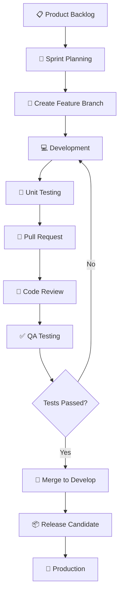
---

# 🛠 Local Development

## Prerequisites

Install the following software before starting.

| Requirement | Version |
|-------------|---------|
| Node.js | 22+ |
| pnpm | 10+ |
| Prisma Postgres | Managed PostgreSQL |
| Redis | 8+ |
| Docker | Latest (Optional) |
| Git | Latest |

---

## Clone Repository

```bash
git clone https://github.com/evillan0315/vestara.git

cd vestara
```

---

## Install Dependencies

```bash
pnpm install
```

---

## Configure Environment

Create a local environment file.

```bash
cp .env.example .env
```

---

## Example Environment

```env
NODE_ENV=development

PORT=5000

DATABASE_URL='postgres://...@db.prisma.io:5432/postgres?sslmode=require'

REDIS_URL=redis://localhost:6379

JWT_SECRET=replace-with-secure-secret

JWT_REFRESH_SECRET=replace-with-secure-secret

JWT_EXPIRES_IN=15m

JWT_REFRESH_EXPIRES_IN=30d

OPENCODE_API_KEY=your-opencode-api-key

OPENCODE_BASE_URL=https://opencode.ai/zen/v1

SMTP_HOST=

SMTP_PORT=

SMTP_USER=

SMTP_PASSWORD=

S3_ENDPOINT=

S3_BUCKET=

S3_ACCESS_KEY=

S3_SECRET_KEY=
```

> **Note**: `DATABASE_URL` is auto-generated by `prisma postgres link`. Never commit this value.

---

# 🗄 Database Setup

Generate Prisma Client.

```bash
pnpm prisma generate
```

Run migrations.

```bash
pnpm prisma migrate dev
```

Seed development data.

```bash
pnpm prisma db seed
```

Open Prisma Studio.

```bash
pnpm prisma studio
```

---

# ▶ Running the Project

Run everything.

```bash
pnpm dev
```

Run frontend only.

```bash
pnpm dev:web
```

Run backend only.

```bash
pnpm dev:api
```

---

# 📜 Available Scripts

| Command | Description |
|----------|-------------|
| pnpm dev | Start all services (web + api) |
| pnpm dev:web | Start frontend (Vite dev server) |
| pnpm dev:api | Start backend (Express with tsx watch) |
| pnpm build | Build all packages and apps |
| pnpm build:web | Build frontend only |
| pnpm build:api | Build backend only |
| pnpm lint | Run ESLint across all packages |
| pnpm format | Format source code with Prettier |
| pnpm format:check | Check formatting without changes |
| pnpm typecheck | TypeScript strict type checking |
| pnpm test | Run tests |
| pnpm prisma:generate | Generate Prisma Client |
| pnpm prisma:migrate | Run database migrations |
| pnpm prisma:studio | Open Prisma Studio |
| pnpm prisma:seed | Seed development data |
| pnpm deploy:api | Deploy API to Vercel (production) |
| pnpm clean | Clean all build artifacts |

---

# 🗄 Database Architecture

Vestara is built on **Prisma Postgres** (hosted PostgreSQL) using Prisma ORM v7 with the `PrismaPg` driver adapter.

The schema is organized by business domains rather than technical layers.

```text
Authentication
│
├── users
├── roles
├── permissions
└── sessions

Profiles
│
├── profiles
├── user_settings
└── kyc_documents

Wallet
│
├── wallets
├── wallet_accounts
├── wallet_transactions
└── wallet_ledgers

Rewards
│
├── points_accounts
├── points_transactions
└── rewards

Marketplace
│
├── products
├── product_images
├── categories
├── inventory
└── sellers

Orders
│
├── orders
├── order_items
├── carts
└── cart_items

Bookings
│
├── bookings
├── reservations
├── booking_items
├── destinations
├── properties
└── calendars

Payments
│
├── deposits
├── withdrawals
├── transfers
└── payment_transactions

Administration
│
├── audit_logs
├── admin_actions
├── risk_events
└── reports
```

---

# 🔐 Security Architecture

Security is a foundational principle throughout Vestara.

## Authentication

- JWT Access Tokens
- Refresh Token Rotation
- Secure Password Hashing
- Email Verification
- Session Management
- Device Tracking

---

## Authorization

- RBAC
- Fine-Grained Permissions
- Policy-Based Authorization
- Least Privilege Access

---

## API Security

- Request Validation
- Rate Limiting
- Input Sanitization
- CORS Protection
- CSRF Protection (where applicable)
- Secure Headers
- OpenAPI Validation

---

## Infrastructure Security

- HTTPS Everywhere
- Secure Cookies
- Environment Isolation
- Secrets Management
- Docker Image Scanning
- Dependency Auditing

---

## Logging & Auditing

Every critical action is recorded.

Examples include:

- User Login
- Password Changes
- Wallet Transfers
- Payment Approvals
- Booking Changes
- Marketplace Moderation
- Permission Updates
- Administrative Actions

---

## Future Security Enhancements

- Multi-Factor Authentication (MFA)
- WebAuthn / Passkeys
- AI Fraud Detection
- Behavioral Analytics
- Device Trust
- Geo-Fencing
- Adaptive Authentication
- Security Information & Event Management (SIEM)

---

# 📖 API Documentation

Vestara follows an API-first development approach.

Every endpoint is documented using OpenAPI.

```text
REST API
        │
        ▼
Express Controllers / Routes
        │
        ▼
Services
        │
        ▼
Repositories
        │
        ▼
Prisma Postgres
```

## 📖 API Architecture

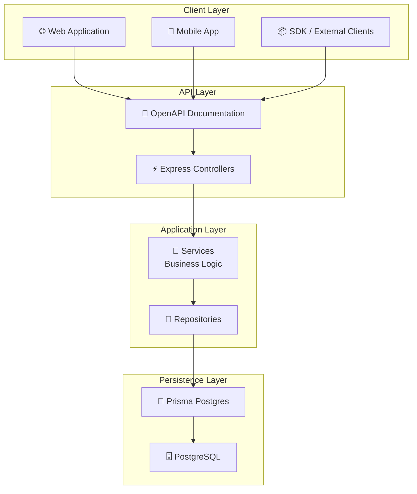

Generated documentation includes:

- Endpoint descriptions
- Request schemas
- Response schemas
- Authentication requirements
- Error responses
- Example payloads

---

# 🧪 Quality Assurance

Every change is validated through automated quality gates.

- ESLint
- TypeScript Strict Mode
- Unit Tests
- Integration Tests
- API Validation
- Build Verification
- Dependency Scanning

All pull requests must pass the CI pipeline before merging.

---

# 🧪 Testing Strategy

Vestara adopts a comprehensive testing strategy to ensure reliability, maintainability, and confidence throughout the development lifecycle.

Testing is integrated into every stage of development, from local development to production deployments.

---

## Testing Pyramid

```text
                ▲
                │
         End-to-End Tests
      (Critical User Flows)
                │
        Integration Tests
      (Modules & Services)
                │
          Unit Tests
   (Functions & Components)
                ▼
```

---

## Unit Testing

Unit tests validate isolated business logic, utility functions, React components, and backend services.

### Frontend

- React Components
- Hooks
- Utilities
- Stores
- Validation Schemas

### Backend

- Services
- Repositories
- Domain Logic
- Helpers
- Business Rules

---

## Integration Testing

Integration tests verify communication between modules.

Examples:

- Authentication
- Wallet Transfers
- Marketplace Checkout
- Booking Flow
- Rewards Distribution
- Payment Processing

---

## End-to-End Testing

Critical user journeys are validated from the user's perspective.

Examples:

- User Registration
- Login
- Wallet Creation
- Deposit Workflow
- Marketplace Purchase
- Booking Reservation
- Admin Approval
- Checkout Process

---

## Code Quality

Every commit is validated through automated quality checks.

- ESLint
- TypeScript Strict Mode
- Formatting
- Dependency Analysis
- Dead Code Detection
- API Validation
- Build Verification

---

## 🚀 Continuous Integration & Continuous Deployment

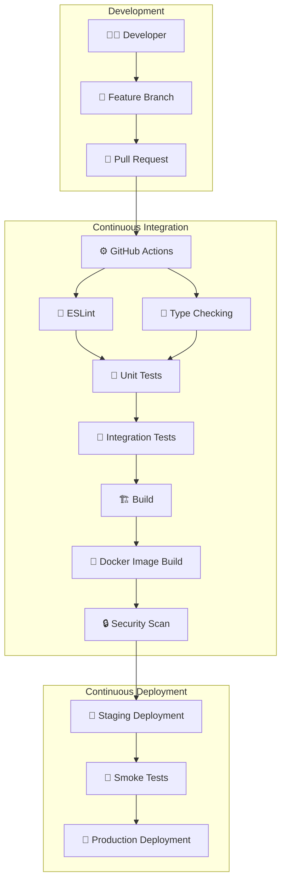
---

## CI Pipeline

Every Pull Request automatically performs:

- Install Dependencies
- Cache Packages
- Lint Source Code
- Type Checking
- Unit Tests
- Integration Tests
- Build Applications
- Generate Prisma Client
- Validate OpenAPI
- Dependency Audit

---

## CD Pipeline

Production deployments include:

- Build Docker Images
- Publish Artifacts
- Database Migration
- Deploy Backend
- Deploy Frontend
- Health Checks
- Smoke Tests
- Monitoring Verification

---

## 🏗️ Deployment Architecture

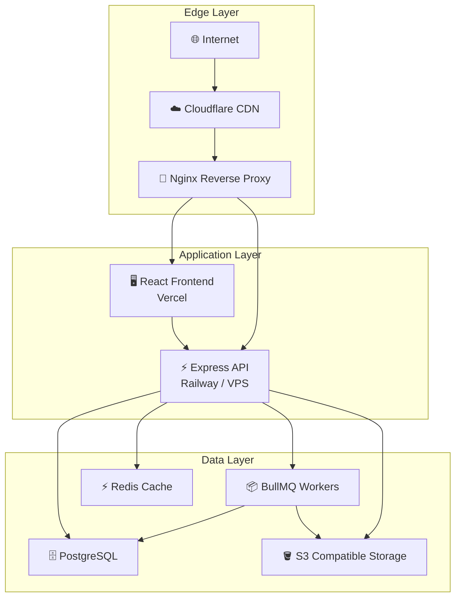
---

## Deployment Targets

### Frontend (Current)

- ✅ **Vercel** — `vestara-admin-web.vercel.app`

### Backend (Current)

- ✅ **Vercel Serverless** — `vestara-admin-api.vercel.app` (Express mounted at `/api/v1`)

### Database (Current)

- **Prisma Postgres** — hosted PostgreSQL with `PrismaPg` adapter
- **Multi-Tenant Schema** — Organization model with org-scoped resources (Users, SystemSettings, AuditLogs, Sessions, RefreshTokens)

---

### Storage

- Amazon S3
- Cloudflare R2
- MinIO
- DigitalOcean Spaces

---

# 📈 Performance

Performance is considered a first-class feature throughout the platform.

## Frontend Optimizations

- Code Splitting
- Lazy Loading
- Route-Based Chunks
- Tree Shaking
- Image Optimization
- Virtualized Lists
- Suspense
- Memoization

---

## Backend Optimizations

- Redis Caching
- Database Indexing
- Connection Pooling
- Background Jobs
- Efficient Pagination
- Query Optimization
- Streaming Responses

---

## Database Optimizations

- Indexed Queries
- Optimized Relations
- Transactions
- Batch Processing
- Connection Reuse

---

## Infrastructure Optimizations

- CDN
- HTTP Compression
- Static Asset Caching
- Docker Layer Caching
- Load Balancing
- Horizontal Scaling

---

# 📊 Monitoring & Observability

Vestara includes comprehensive monitoring to ensure system reliability.

## Application Monitoring

- API Response Times
- Request Volume
- Error Rates
- Queue Status
- Cache Performance
- Database Health

---

## Infrastructure Monitoring

- CPU Usage
- Memory Usage
- Disk Usage
- Network Traffic
- Container Health
- Uptime

---

## Business Metrics

- User Growth
- Active Users
- Wallet Volume
- Marketplace Revenue
- Booking Revenue
- Reward Distribution
- Transaction Success Rate

---

# 🤝 Contributing

We welcome contributions that improve Vestara.

Before submitting a Pull Request, ensure that:

- Code follows the project architecture.
- New functionality includes tests.
- Documentation is updated.
- TypeScript passes strict type checking.
- ESLint reports zero errors.
- The project builds successfully.

---

## Development Standards

- TypeScript Strict Mode
- Feature-Based Architecture
- Domain-Driven Design
- Modular Packages
- Conventional Commits
- Pull Request Reviews
- Automated CI Checks

---

## Before Opening a Pull Request

Run the following commands:

```bash
pnpm lint

pnpm typecheck

pnpm test

pnpm build
```

---

# 📚 Documentation

Project documentation lives in the [`/docs`](./docs) directory:

- [Developer Guide](./docs/DEVELOPER_GUIDE.md) — setup, common commands, how to add backend/frontend features, testing, troubleshooting
- [API Documentation](./docs/api/README.md) — endpoints, auth, error codes, data models, architecture
- [Deployment Guide](./docs/DEPLOYMENT.md) — Vercel deployment (API + web), environment variables, OAuth, rollback, monitoring
- [Self-Hosted Deployment Guide](./docs/SELF_HOSTED_DEPLOYMENT.md) — full Ubuntu 24.04 walkthrough (Node + PM2 + Nginx + PostgreSQL + Redis + Let's Encrypt)
- [Architecture Decision Records](./docs/decisions/README.md) — key technology and design decisions (monorepo, React/MUI, Express/Prisma, JWT, Vercel, Zod, OAuth)
- [Roadmap](./ROADMAP.md) — phased delivery plan and status

Additional references: Architecture overview (this README), Security, Database Design, and UI Guidelines sections above.

---

# 🔒 Security

If you discover a security vulnerability, please report it privately instead of creating a public issue.

Include:

- Description
- Steps to Reproduce
- Impact Assessment
- Suggested Mitigation

Security reports are handled with priority.

---

# 📄 License

This project is currently licensed under a **Proprietary License**.

All rights reserved.

Unauthorized copying, modification, distribution, or commercial use without written permission is prohibited.

Future licensing terms may change as the platform evolves.

---

# 📌 Project Status

| Category | Status |
|----------|--------|
| Development | 🚧 Active |
| Current Phase | Phase 1 – Admin Dashboard MVP (Phases 1–17 coverage) |
| API (Express) | 🟢 Deployed to Vercel |
| Frontend (React) | 🟢 Deployed to Vercel |
| OAuth (Google + GitHub) | 🟢 Configured + Working |
| User Management (CRUD) | 🟢 Complete (backend + frontend) |
| Roles & Permissions (RBAC) | 🟢 Implemented (enum-based) |
| Data Table | 🟢 Reusable, sort/filter/paginate/select |
| Organizations | 🟢 Complete (list/create/edit + DataTable UI) |
| Application Settings | 🟢 Complete (backend + frontend) |
| File Manager | 🟢 Complete (backend + frontend with upload, folders, preview) |
| User Profile (name, avatar, password, email change, account deletion) | 🟢 Complete (backend + frontend) |
| User Preferences (Modal) | 🟢 Complete (Appearance, Notifications, Localization) |
| Global Search (Cmd/Ctrl+K) | 🟢 Complete |
| Sidebar Navigation (platform-domain categories) | 🟢 Complete (Wallet & Payments, Marketplace, Bookings, Rewards, AI Services, Management, System, Security; roadmap modules marked "Soon") |
| Audit Logs / System Logs | 🟢 API + Frontend Page |
| CI/CD (GitHub Actions) | 🟢 API Deploy Workflow |
| Reusable Form Components | 🟢 Complete (14 components + Zod) |
| Feedback Components | 🟢 Complete (Toast queue, Loading, EmptyState, useConfirm) |
| Mobile | 📋 Planned |
| AI Chatbot | 🟢 Complete (OpenCode + multi-provider fallback) |
| AI Assistant RAG | 🟢 Complete (data-aware, real-time org context) |
| Floating Chat Widget | 🟢 Complete (FAB, keyboard shortcut, page-aware suggestions, minimized bar, full-page nav) |
| Investment Platform | 📋 Planned |
| Blockchain | 📋 Planned |

---

## Current Focus

- ✅ Administration Dashboard (responsive layout, sidebar, OAuth auth)
- ✅ Authentication (JWT, OAuth Google + GitHub)
- ✅ Vercel Deployment (API + Web)
- ✅ User Management (CRUD with full backend + frontend)
- ✅ Roles & Permissions (RBAC via `requireRole` middleware)
- ✅ Reusable Data Table (sort/filter/paginate/select)
- ✅ Application Settings (CRUD backend + frontend)
- ✅ System Audit Logs (API + DataTable page)
- ✅ GitHub Actions CI/CD (API deployment workflow)
- ✅ User Profile (name, avatar, password change)
- ✅ Reusable Form Components (FormField, FormInput, FormSelect, FormTextarea, FormCheckbox, FormRadioGroup, FormSwitch, FormError, FormHelperText, FormSection, FormLayout, FormActions, FormSubmit, FormCancel)
- ✅ Reusable Feedback Components (Toast queue, Loading, EmptyState, useConfirm)
- ✅ Form Validation (react-hook-form + Zod via useFormWithZod)
- ✅ File Manager (browser, upload, folders, preview, rename, move, delete)
- ✅ User Preferences Modal (Appearance, Notifications, Localization)
- ✅ Global Search Dialog (Cmd/Ctrl+K with keyboard navigation)
- ✅ Notifications (wired to audit-logs API, real-time unread count)
- ✅ BigInt serialization fix (File Manager 500 error resolved)
- ✅ Auth tests: 11/11 reliable (FK cleanup order, timeout adjusted)
- ✅ `deploy:api` NPM script for one-command Vercel deployment
- ✅ AI Chatbot (OpenCode integration, multi-provider, conversation history, responsive UI)
- ✅ AI Assistant RAG (data-aware, real-time org context injection)
- ✅ Floating Chat Widget (FAB, keyboard shortcut `Cmd+Shift+K`, page-aware suggestions, minimized bar, full-page nav)
- ✅ Sidebar Navigation (reorganized into platform-domain categories: Wallet & Payments, Marketplace, Bookings, Rewards, AI Services, Management, System, Security; roadmap modules marked "Soon")
- 🟡 Security Hardening (rate limiting, CSRF, password policies)
- 📋 Reporting (CSV/Excel/PDF export)
- 📋 Real-time features (WebSocket, live notifications)
- 📋 Testing & Performance optimization

---

## Target Release

```text
Phase 1 MVP
Q4 2026
```

---

# 🌍 Vision for the Future

Vestara is more than a digital wallet or marketplace—it is a long-term platform for digital commerce, financial services, investments, and intelligent wealth creation.

Our goal is to provide individuals and businesses with a secure, unified ecosystem where they can manage money, earn rewards, trade products, book premium services, and access future investment opportunities without switching between disconnected platforms.

As the ecosystem grows, Vestara will continue to evolve through emerging technologies such as artificial intelligence, digital assets, tokenization, decentralized finance, and intelligent automation, while maintaining a strong commitment to security, scalability, and exceptional user experience.

---

# 💙 Acknowledgements

Vestara is built using modern open-source technologies and inspired by the engineering excellence of leading software companies and communities.

Special thanks to the teams behind:

- React
- TypeScript
- Express
- Prisma
- PostgreSQL
- Redis
- Material UI
- Tailwind CSS
- TanStack
- pnpm
- Docker
- GitHub Actions

Their tools and communities make projects like Vestara possible.

---

# ⭐ Support the Project

If you find Vestara interesting or useful:

- ⭐ Star the repository
- 🍴 Fork the project
- 🐛 Report issues
- 💡 Suggest features
- 🤝 Contribute improvements
- 📢 Share the project with others

Your support helps shape the future of the Vestara ecosystem.

---

<div align="center">

# VESTARA

### **Build. Trade. Earn. Grow.**

*A unified ecosystem for digital finance, commerce, rewards, bookings, and future investment opportunities.*

**Made with ❤️ using React, TypeScript, Express, Prisma Postgres, and modern cloud-native technologies.**

</div>
````

### Opencode one liner command

```bash
opencode run --agent developer --model opencode/deepseek-v4-flash-free --auto --print-logs --log-level INFO "Before performing any work, search for and read AGENTS.md, INSTRUCTION.md, and README.md from the project root, as well as any applicable nested AGENTS.md or INSTRUCTION.md files within the directories you modify. Treat AGENTS.md as the highest-priority source of agent behavior, workflows, coding standards, and project conventions. Treat INSTRUCTION.md as the authoritative source for feature-specific, module-specific, or implementation-specific instructions. Treat README.md as the primary source for the project overview, architecture, setup, requirements, and development guidelines. When instructions conflict, follow this precedence: (1) the most specific nested AGENTS.md, (2) the most specific nested INSTRUCTION.md, (3) the root AGENTS.md, (4) the root INSTRUCTION.md, and (5) the README.md. Report any missing files that are expected, summarize the applicable instructions before making changes, and ensure every implementation fully complies with them before executing the requested task."
```


