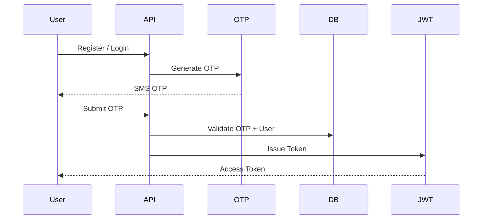
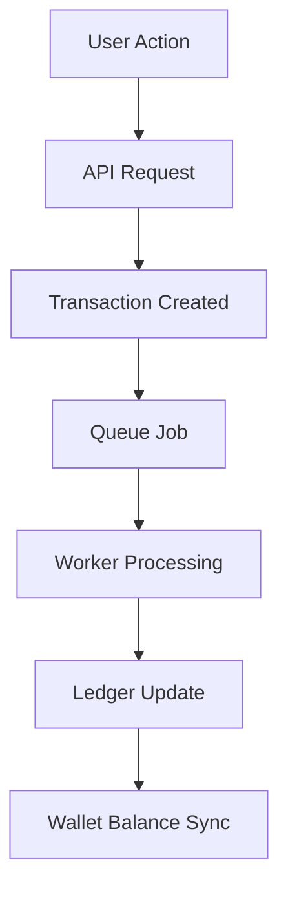
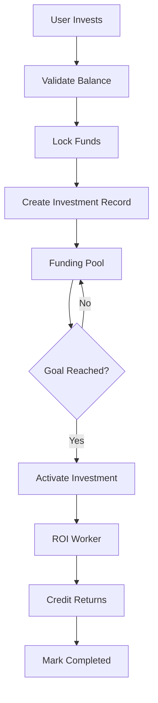

# Vestara API

**Digital Investment & Funding Platform**

A secure, modular, and scalable backend API powering Vestara’s wallet system, investment marketplace, transaction engine, and administrative ecosystem.

---

## Overview

Vestara API is designed as an event-driven fintech backend with strict financial consistency and modular domain isolation.

It provides:

- Authentication with OTP-based verification
- Digital wallet management (deposits, withdrawals, balances)
- Investment product marketplace
- Automated ROI computation and lifecycle processing
- Transaction ledger with audit logging
- Admin control panel APIs
- Background job processing for financial workflows

---

## Base URL

```

Production: [https://vestara-api.vercel.app/](https://vestara-api.vercel.app/)

```

---

## Architecture Overview

Vestara follows a **modular layered architecture** built on Fastify + TypeScript with DI support.

```

Controller → Service → Repository → Database / External Services

````

---

## System Design

```mermaid
flowchart TD
A[Client Apps] --> B[Fastify API Gateway]

B --> C[Auth Module]
B --> D[Wallet Module]
B --> E[Investment Module]
B --> F[Payment Module]
B --> G[Admin Module]

C --> H[(PostgreSQL)]
D --> H
E --> H
F --> H
G --> H

D --> I[Redis Queue - BullMQ]
E --> I
F --> I

I --> J[Workers Layer]
J --> K[ROI Engine]
J --> L[Payment Reconciliation]
J --> M[Notification System]
J --> N[Investment Lifecycle Processor]
````

---

## Core Modules

### 1. Authentication Module

Handles secure onboarding and identity verification.

* OTP-based registration
* Login with JWT issuance
* Token validation middleware
* Rate-limited authentication flows

---

### 2. Wallet Module

Manages all financial balances and ledger updates.

* Deposit processing
* Withdrawal requests
* Balance computation (available / invested / pending)
* Transaction history
* Ledger consistency enforcement

---

### 3. Investment Module

Handles investment lifecycle and ROI logic.

* Product listing and management
* Investment creation
* Fund locking mechanism
* Automated ROI distribution
* Investment state transitions

**States:**

```
OPEN → FUNDING → ACTIVE → MATURED → COMPLETED
```

---

### 4. Payment Module

Manages external payment integrations.

* GCash / Maya / Bank transfers
* Webhook verification
* Payment reconciliation
* Transaction status updates

---

### 5. Admin Module

Administrative control layer.

* User verification & suspension
* Deposit/withdrawal approvals
* Investment product management
* Reports & analytics endpoints

---

## Data Layer

### Core Entities

#### User

```ts
interface User {
  id: string;
  mobileNumber: string;
  passwordHash: string;
  isVerified: boolean;
  createdAt: Date;
}
```

#### Wallet

```ts
interface Wallet {
  userId: string;
  availableBalance: number;
  investedBalance: number;
  pendingBalance: number;
  totalEarnings: number;
}
```

#### Investment Product

```ts
interface InvestmentProduct {
  id: string;
  name: string;
  fundingGoal: number;
  minInvestment: number;
  maxInvestment: number;
  expectedReturn: number;
  duration: number;
  status: "OPEN" | "FUNDING" | "ACTIVE" | "MATURED";
}
```

#### Investment

```ts
interface Investment {
  id: string;
  userId: string;
  productId: string;
  amount: number;
  status: "ACTIVE" | "COMPLETED";
  startDate: Date;
  maturityDate: Date;
}
```

#### Transaction (Ledger Core)

```ts
interface Transaction {
  id: string;
  userId: string;
  type: "DEPOSIT" | "WITHDRAW" | "INVEST" | "RETURN";
  amount: number;
  method: string;
  status: "PENDING" | "COMPLETED" | "FAILED";
  createdAt: Date;
}
```

---

## Authentication Flow



---

## Wallet Flow



---

## Investment Flow



---

## Background Jobs

Powered by **BullMQ + Redis**

### Workers

* ROI Calculation Worker
* Payment Reconciliation Worker
* Notification Dispatcher
* Investment Lifecycle Processor

---

## Security

* JWT Authentication
* OTP Verification (SMS-based)
* Password hashing (bcrypt)
* DTO validation layer
* Rate limiting per endpoint
* Webhook signature verification
* Audit logging for all financial operations
* Fraud detection hooks

---

## Tech Stack

* **Backend:** Fastify + TypeScript
* **Architecture:** Modular + DI-based
* **Database:** PostgreSQL (Prisma)
* **Cache / Queue:** Redis + BullMQ
* **Auth:** JWT + OTP system
* **Infra:** Docker, Nginx
* **Deployment:** Vercel / AWS / DigitalOcean

---

## Background Processing

* Scheduled ROI computation
* Investment maturity automation
* Wallet balance reconciliation
* Payment confirmation sync
* Notification delivery system

---

## Rate Limiting

* 100 requests / minute per user
* 10 OTP requests / hour per mobile number
* Admin routes protected via RBAC

---

## Error Format

```json
{
  "statusCode": 400,
  "message": "Invalid request",
  "error": "Bad Request"
}
```

---

## Design Principles

* Strict separation of concerns (Controller → Service → Repository)
* No business logic in controllers
* Stateless services
* Event-driven financial processing
* Idempotent transaction design
* Ledger-first accounting model
* Background workers for heavy operations

---

## Folder Architecture
```
.
├── .env
├── .env.local
├── .github
│   └── workflows
│       └── sync-subscribers.yml
├── docs
│   ├── Architecture.md
│   └── Workflow.md
├── src
│   ├── config
│   │   ├── env.ts
│   │   └── logger.ts
│   │
│   ├── modules
│   │   ├── subscribers
│   │   │   ├── subscribers.route.ts
│   │   │   ├── subscribers.service.ts
│   │   │   └── subscribers.types.ts
│   │   │
│   │   ├── upload
│   │   │   ├── upload.route.ts
│   │   │   ├── upload.service.ts
│   │   │   └── upload.types.ts
│   │   │
│   │   └── sync
│   │       ├── sync.route.ts
│   │       ├── sync.service.ts
│   │       └── sync.types.ts
│   │
│   ├── scripts
│   │   └── sync-subscribers.ts
│   │
│   ├── shared
│   │   ├── constants
│   │   ├── errors
│   │   ├── types
│   │   └── utils
│   │
│   ├── bootstrap
│   │   ├── register-plugins.ts
│   │   └── register-routes.ts
│   │
│   ├── plugins
│   │   └── swagger.plugin.ts
│   │
│   ├── app.ts
│   └── server.ts
│
├── README.md
├── package.json
├── package-lock.json
└── tsconfig.json
```

```
src
├── bootstrap
├── config
├── modules
│   ├── auth
│   ├── users
│   ├── wallet
│   ├── investments
│   ├── transactions
│   ├── payments
│   ├── subscribers
│   ├── uploads
│   └── admin
├── jobs
├── plugins
├── shared
│   ├── constants
│   ├── dto
│   ├── errors
│   ├── types
│   └── utils
├── app.ts
└── server.ts
```

```
src/
├── modules/
│   ├── auth/
│   ├── wallet/
│   ├── investment/
│   ├── payment/
│   ├── admin/
│
├── jobs/
├── plugins/
├── shared/
├── config/
├── database/
└── bootstrap/
```

---

## Conclusion

Vestara API is a modular fintech backend designed for high reliability, financial accuracy, and scalable investment processing. It is built to support real-time transactions, automated ROI workflows, and secure multi-user financial operations.

