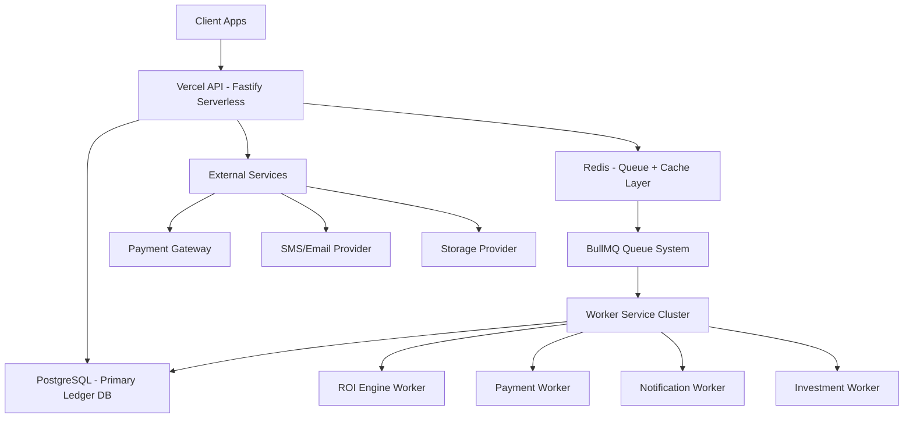
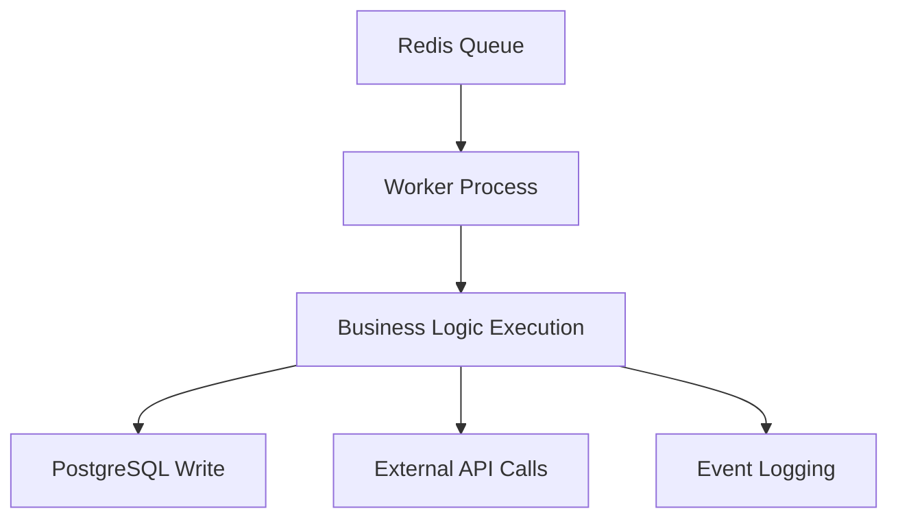
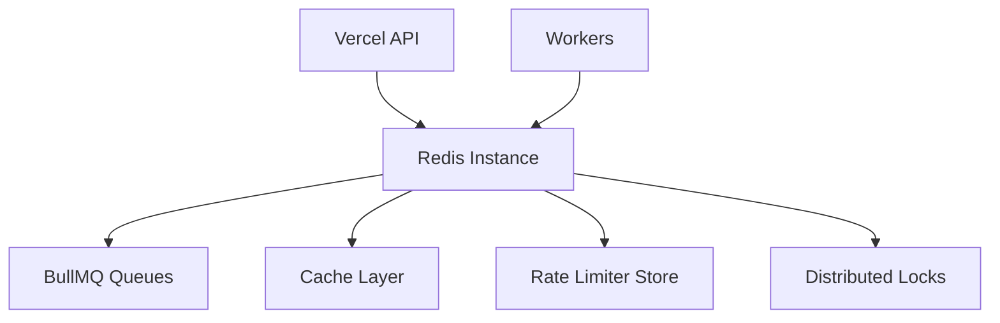
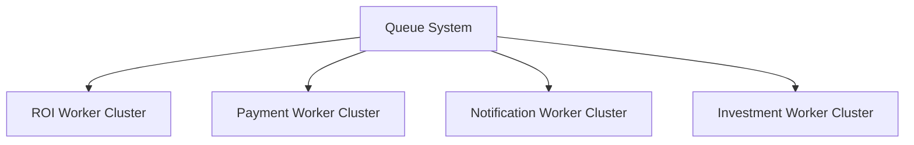
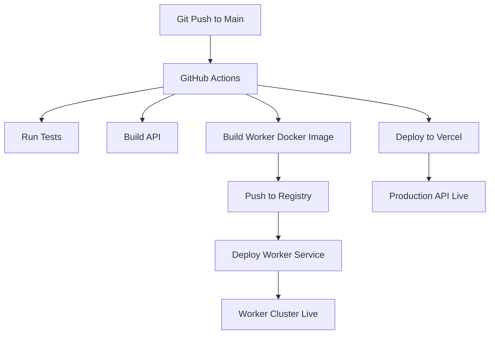
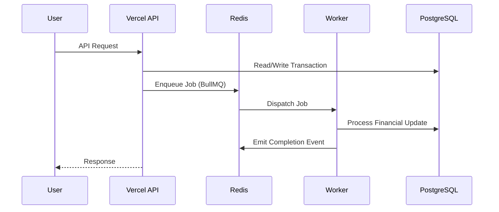

# 🚀 Deployment

## Production Deployment Workflow (Vercel + Workers + Redis Topology)

This document defines the **production infrastructure architecture** for Vestara, including:

* API deployment (Vercel)
* Background workers (separate compute layer)
* Redis (queue + cache backbone)
* PostgreSQL (ledger source of truth)
* CI/CD pipeline flow
* Runtime communication topology

---

# 🧭 1. High-Level Production Architecture

Vestara is deployed as a **hybrid serverless + worker-based system**.



---

# ⚙️ 2. Deployment Components

## 2.1 Vercel (API Layer)

### Responsibilities

* HTTP API (Fastify adapter or edge-compatible handler)
* Authentication
* Transaction orchestration
* Queue job publishing

### Constraints

* Stateless execution
* No long-running jobs
* No direct background processing

### Environment Variables

```bash
DATABASE_URL=
REDIS_URL=
JWT_SECRET=
BULLMQ_PREFIX=vestara
PAYMENT_GATEWAY_KEY=
```

---

## 2.2 Worker Service (Dedicated Compute Layer)

Workers run independently from Vercel.

### Responsibilities

* ROI calculations
* Investment lifecycle processing
* Payment reconciliation
* Notification dispatch

---

### Deployment Options

#### Option A (Recommended)

* Docker container on:

  * AWS ECS / Fly.io / Railway / Render

#### Option B

* Node.js VM (PM2)
* Auto-restart process manager

---

### Worker Runtime Flow



---

# 🧠 3. Redis Topology (Critical Layer)

Redis acts as:

* Queue broker (BullMQ)
* Cache layer (session, rate limiting)
* Distributed lock manager

---

## 3.1 Redis Architecture



---

## 3.2 Redis Usage Breakdown

| Feature       | Purpose                                |
| ------------- | -------------------------------------- |
| BullMQ Queues | Async job processing                   |
| Cache         | Fast lookup (users, configs)           |
| Rate Limiting | API protection                         |
| Locks         | Prevent double ROI / duplicate payouts |

---

## 3.3 Recommended Redis Setup

### Production Setup

* Redis Cloud / Upstash / AWS ElastiCache
* Enable persistence (AOF + snapshotting)
* Enable eviction policy: `allkeys-lru`

---

# 🏗️ 4. Worker Topology Design

## 4.1 Worker Clusters



---

## 4.2 Worker Isolation Principle

Each worker group:

* has isolated queue
* has retry policy
* can scale independently
* avoids shared state

---

## 4.3 Example Queue Mapping

| Queue            | Worker              |
| ---------------- | ------------------- |
| roi.queue        | ROI Engine          |
| payment.queue    | Payment Worker      |
| notify.queue     | Notification Worker |
| investment.queue | Investment Worker   |

---

# 🔄 5. CI/CD Pipeline (GitHub Actions → Vercel + Workers)

## 5.1 Deployment Flow



---

## 5.2 GitHub Actions Breakdown

### API Deployment (Vercel)

* lint
* test
* build
* deploy via Vercel CLI

---

### Worker Deployment

* build Docker image
* push to registry
* restart worker cluster

---

# 🌐 6. Runtime Communication Flow

## 6.1 Request Lifecycle



---

# 💰 7. Financial Safety Architecture

## 7.1 Critical Rule

> Vercel NEVER performs financial computations.

All financial operations are delegated to workers.

---

## 7.2 Why This Matters

Prevents:

* double ROI payouts
* race conditions in wallet updates
* inconsistent ledger states
* cold-start duplication bugs

---

## 7.3 Idempotency Layer

Every job includes:

```ts id="idempotency_1"
{
  jobId: string,
  idempotencyKey: string,
  type: string
}
```

Redis enforces uniqueness:

* prevents duplicate execution
* ensures safe retries

---

# 📦 8. Database Topology

## 8.1 PostgreSQL Role

Acts as:

* ledger system (source of truth)
* transactional store
* audit history

---

## 8.2 Scaling Strategy

* read replicas for analytics
* partitioned transaction tables (future)
* indexed ledger queries

---

# ⚡ 9. Performance Strategy

## 9.1 Vercel (API Layer)

* edge caching where possible
* stateless execution
* minimal compute logic

---

## 9.2 Workers

* horizontally scalable
* queue-based load distribution
* retry + DLQ (dead-letter queue)

---

## 9.3 Redis

* in-memory speed layer
* TTL-based caching
* queue buffering under load spikes

---

# 🔐 10. Security Architecture

## 10.1 API Layer

* JWT validation
* rate limiting (Redis-backed)
* input validation (DTOs)

---

## 10.2 Worker Layer

* job signature validation
* idempotency enforcement
* restricted environment variables

---

## 10.3 Webhook Security

* HMAC signature validation
* replay protection
* timestamp validation

---

# 📊 11. Scaling Model

## Horizontal Scaling

| Component  | Scaling Method              |
| ---------- | --------------------------- |
| Vercel API | auto-scale serverless       |
| Workers    | container replicas          |
| Redis      | clustered / managed service |
| PostgreSQL | read replicas + pooling     |

---

## Bottleneck Prevention

* isolate heavy ROI processing in workers
* avoid synchronous financial writes
* queue-based load smoothing

---

# 🧠 12. System Summary

Vestara production architecture is:

> A **serverless API layer (Vercel) + distributed worker system + Redis-backed event bus + PostgreSQL ledger core**

### Core guarantees:

* API stays stateless
* Workers handle all financial logic
* Redis orchestrates async flow
* PostgreSQL remains single source of truth
* system is horizontally scalable by design
