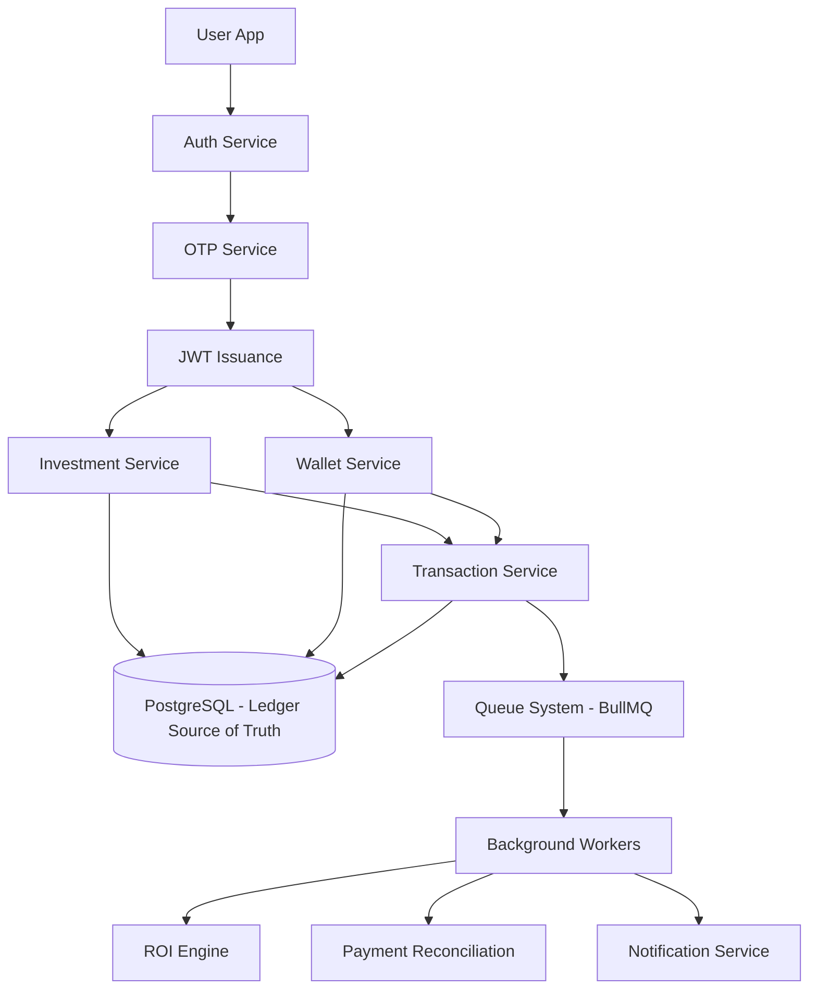
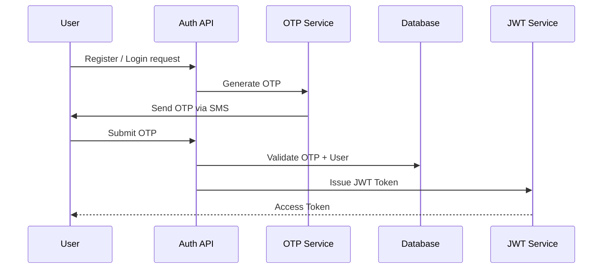
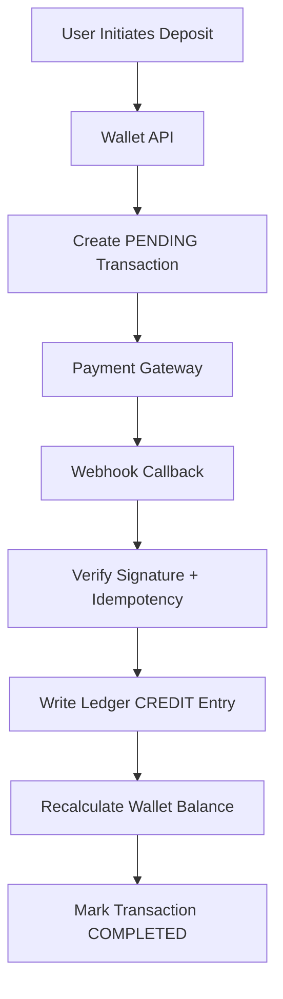
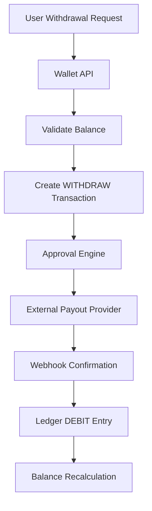
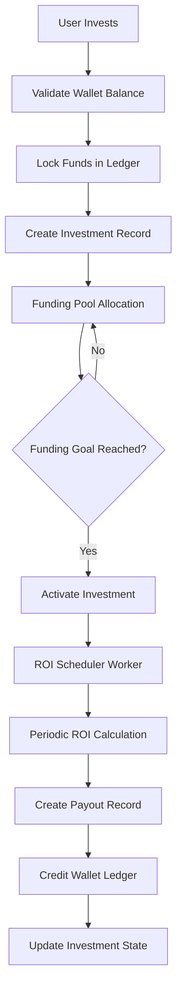
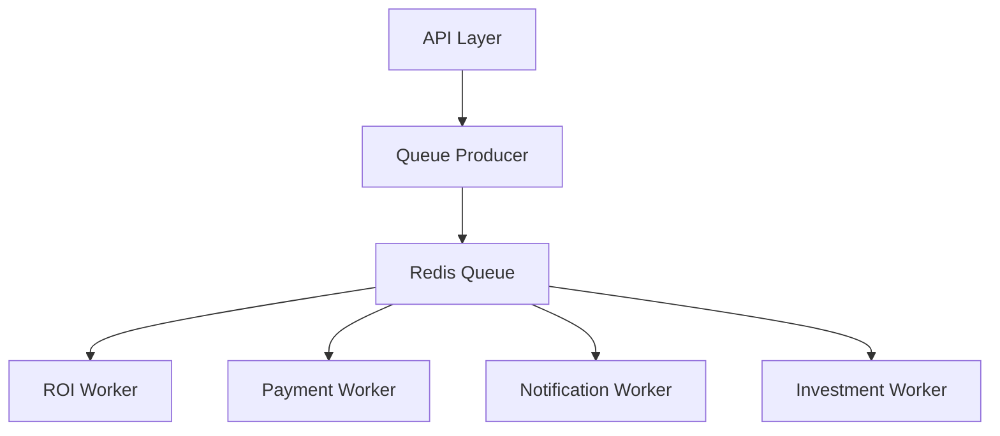
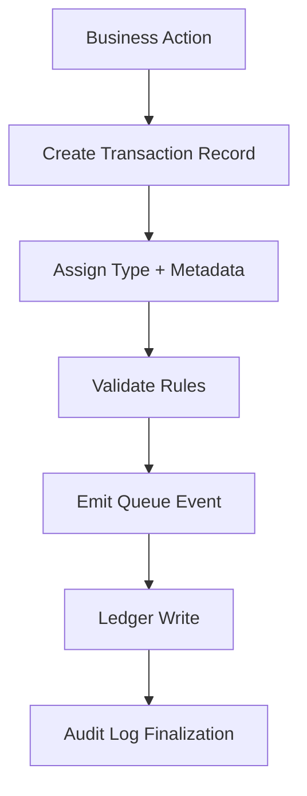
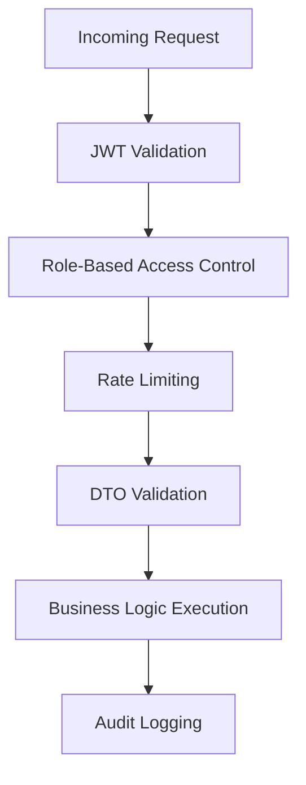
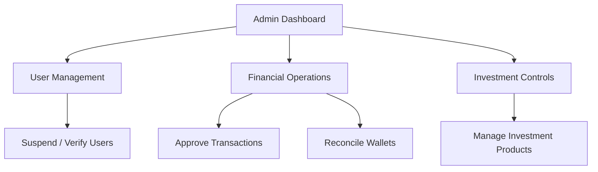
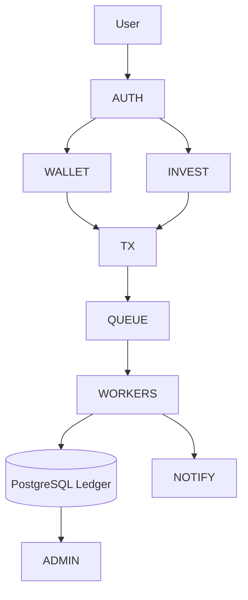

# 🧭 Vestara System Workflow (End-to-End)

---

# 1. High-Level System Flow

This system is built on an **event-driven, ledger-first architecture** where:

* API layer handles commands
* Database stores immutable financial state
* Queue system processes side effects
* Workers execute long-running financial operations



---

# 🔐 2. Authentication Workflow

Authentication is **OTP-gated + JWT session-based** with strict rate limiting and audit logging.



---

## Key Rules

* OTP is **single-use + time-bound**
* JWT contains:

  * `userId`
  * `role`
  * `sessionId`
* Rate limiting per identifier (phone/email)
* All auth attempts are logged for audit

---

# 💰 3. Wallet Workflow (Ledger-Based System)

Wallet is a **derived state system**, not a direct mutable balance.

---

## 3.1 Deposit Flow



---

### State Transitions

```text
PENDING → VERIFIED → COMPLETED → LEDGER_APPLIED
```

---

## 3.2 Withdrawal Flow



---

# 📈 4. Investment Workflow

Investments follow a **state machine + pooled funding model**.

---

## 4.1 Investment Lifecycle



---

## 4.2 Investment States

| State     | Meaning                   |
| --------- | ------------------------- |
| OPEN      | Available for funding     |
| FUNDING   | Collecting capital        |
| ACTIVE    | ROI cycle running         |
| PAUSED    | Temporarily halted        |
| COMPLETED | Fully settled             |
| CANCELLED | Aborted before activation |

---

# ⚙️ 5. Background Job System (BullMQ)

All financial computations are **asynchronous and worker-driven**.



---

## Worker Responsibilities

### 📊 ROI Engine

* Calculates daily/hourly returns
* Generates payout records
* Triggers wallet credit events

---

### 💳 Payment Worker

* Validates webhook integrity
* Reconciles failed payments
* Ensures idempotency

---

### 🔔 Notification Worker

* Sends SMS/email updates
* Investment milestones
* Transaction alerts

---

### 📦 Investment Worker

* Handles lifecycle transitions
* Monitors funding pools
* Closes matured investments

---

# 🔁 6. Transaction System Workflow

Transactions act as the **audit backbone** of the system.



---

## Transaction Types

* DEPOSIT
* WITHDRAW
* INVEST
* ROI
* SYSTEM_ADJUSTMENT

---

# 🧠 7. Consistency Model

The system uses a **hybrid consistency model**:

---

## Strong Consistency

* Wallet ledger writes
* Transaction creation
* Investment state updates

---

## Eventual Consistency

* Notifications
* Email/SMS
* Analytics pipelines

---

## Ledger Rule

```text
Wallet Balance = SUM(CREDITS) - SUM(DEBITS)
```

---

# 🔐 8. Security Workflow

Security is enforced at multiple layers.



---

## Security Layers

* JWT authentication
* OTP verification gate
* Role-based authorization (RBAC)
* Rate limiting per identity
* Webhook signature validation
* Fraud detection hooks (future-ready)

---

# 📊 9. Admin Workflow

Admin layer provides **financial oversight and control mechanisms**.



---

# 🧩 10. Full End-to-End System Flow

This represents the complete lifecycle across all subsystems.



---

# 🧾 Summary

Vestara is designed as a:

> **Ledger-first, event-driven fintech platform with asynchronous financial computation and strict audit integrity**

### Core Properties:

* API layer = command interface
* Ledger = single source of truth
* Workers = financial computation engine
* Queue system = decoupling layer
* Integrations = external side effects only
